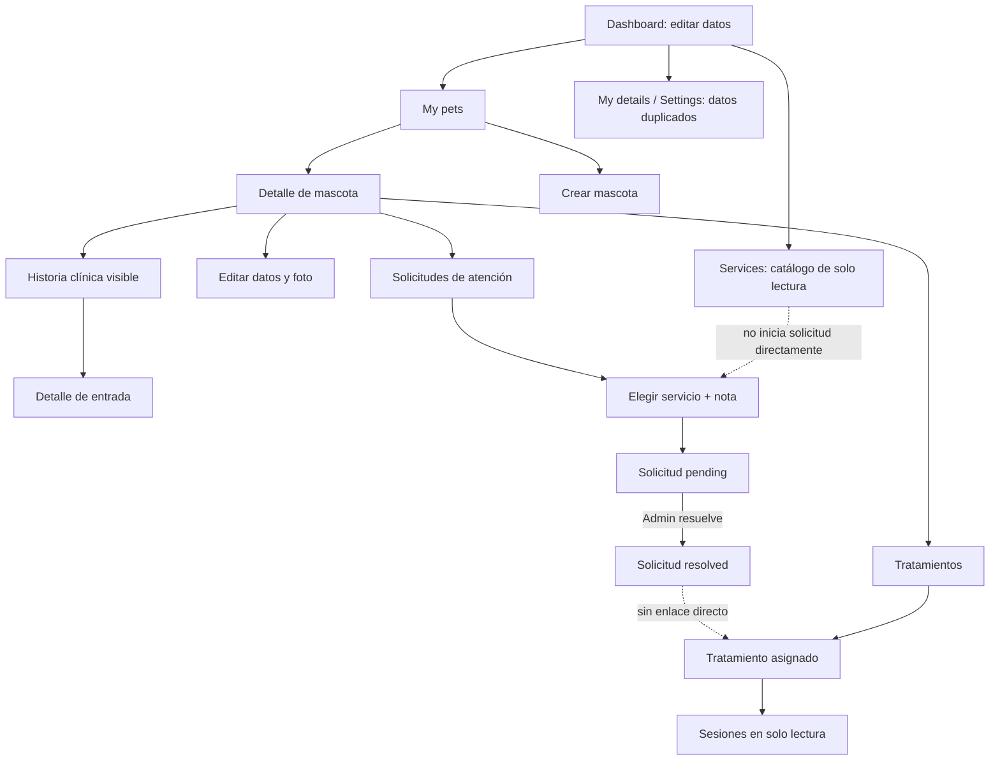
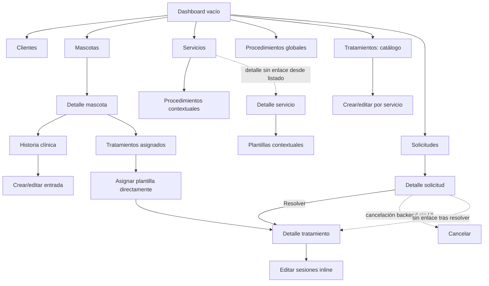
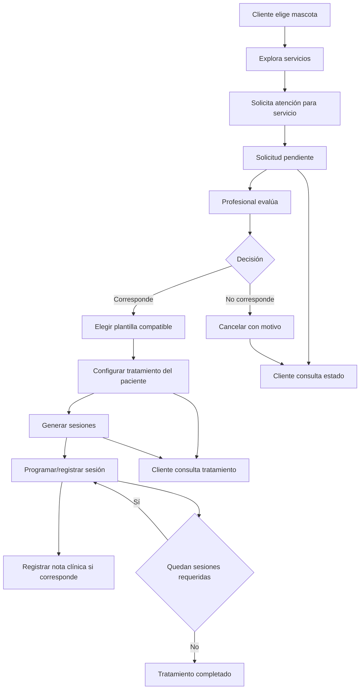
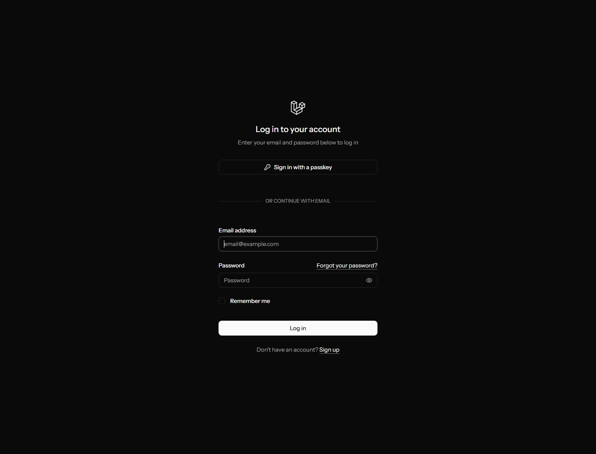
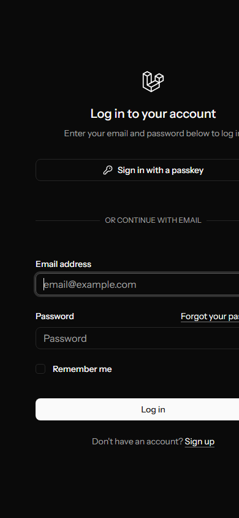

# Auditoría funcional y de experiencia del panel actual de VetZen

Fecha de auditoría: 2026-09-01

> Resolución posterior: la verificación de correo no es obligatoria en la etapa
> actual. La infraestructura se conserva inactiva y el panel requiere
> autenticación, sin middleware `verified`.

## 1. Resumen ejecutivo

VetZen ya dispone de una base funcional considerable para dos perfiles: cliente y administrador. Están implementados autenticación, configuración de cuenta, clientes, mascotas, historias clínicas, catálogo de servicios y procedimientos, solicitudes de atención, plantillas de tratamiento, tratamientos asignados y sesiones. Sin embargo, el frontend conserva una arquitectura de starter kit, presenta navegación fragmentada y no comunica con claridad la diferencia entre catálogo clínico, atención solicitada y atención efectivamente asignada.

Los problemas más importantes son:

1. **Exposición horizontal de tratamientos:** un cliente puede solicitar `GET /admin/pets/{pet}/treatments` para una mascota ajena porque el controlador administrativo autoriza `viewAny` pero no la mascota padre (`app/Http/Controllers/Admin/PetTreatmentController.php:20-27`, `app/Policies/PetTreatmentPolicy.php:10-13`). Es un problema crítico de seguridad y no solamente de UX.
2. **Pantalla administrativa de solicitudes expuesta a clientes:** el propietario de una solicitud puede abrir `GET /admin/service-requests/{serviceRequest}` y recibir la vista administrativa con tratamientos reutilizables del servicio (`app/Http/Controllers/Admin/ServiceRequestController.php:28-32`, `app/Policies/ServiceRequestPolicy.php:16-19`).
3. **Verificación de correo no efectiva:** Fortify y el middleware `verified` están configurados, pero `User` no implementa `MustVerifyEmail`; una cuenta no verificada puede entrar a las rutas protegidas (`app/Models/User.php:5,34-39`, `config/fortify.php:163-175`).
4. **Flujo clínico fragmentado:** solicitudes, plantillas de tratamiento, tratamientos de mascotas y sesiones se encuentran en entradas y contextos diferentes, sin enlaces suficientes entre la solicitud resuelta y el tratamiento resultante, ni mecanismos consistentes para volver.
5. **Interfaz incompleta e inconsistente:** la portada y autenticación conservan textos y marca del starter kit, el panel mezcla inglés y español, los dashboards aportan poco valor operativo y existen controles sin etiqueta, errores no mostrados, paginación no renderizada y acciones backend sin acceso visual.

La reorganización propuesta separa claramente:

- **Pacientes:** clientes, mascotas e historia clínica.
- **Atención:** solicitudes, tratamientos asignados y sesiones.
- **Catálogo clínico:** servicios, procedimientos y plantillas de tratamiento.
- **Cuenta/administración:** seguridad, apariencia y futuras funciones administrativas, sin mostrar módulos todavía inexistentes.

No se implementó ningún rediseño ni se modificó el comportamiento de la aplicación durante esta auditoría.

## 2. Alcance, método y limitaciones

### 2.1 Fuentes revisadas

- Reglas del proyecto: `AGENTS.md`.
- Producto y arquitectura: `spec.md`, `technical.md`, `features.md`.
- Contratos de features: `features/04-ClientsContinuacion.md`, `features/05-Pets.md`, `features/06-MedicalRecords.md`, `features/07-services.md` y `features/08-treatments-and-sessions.md`.
- Rutas: `routes/web.php`, `routes/settings.php` y rutas Fortify registradas.
- Backend: controladores, Policies, Form Requests, modelos, migraciones, servicios de dominio, factories, seeders y pruebas HTTP.
- Frontend: `resources/js/pages`, layouts, navegación, componentes, tipos y rutas/acciones Wayfinder generadas.
- Entorno local: aplicación Laravel 13.29.0, PHP 8.4.5, MySQL 8.4.3, migraciones aplicadas y respuesta HTTP 200 en `http://localhost/vet_zen/public`.

Laravel Boost está instalado, pero sus herramientas estructuradas no estaban disponibles en esta sesión. Se usaron comandos de inspección de Laravel y consultas de solo lectura.

### 2.2 Niveles de evidencia

| Etiqueta | Significado |
|---|---|
| Observado visualmente | Pantalla renderizada con Chrome headless y capturada en esta auditoría. |
| Verificado por HTTP | La aplicación respondió en el entorno local sin cambiar datos de negocio. |
| Verificado en código | Ruta, autorización, controlador y/o página fueron inspeccionados directamente. |
| Respaldado por pruebas existentes | Existe una prueba HTTP en el repositorio; no significa que se haya ejecutado durante esta auditoría. |
| No verificado | No fue posible confirmar la interacción real y se evita inferir el comportamiento visual. |

### 2.3 Datos disponibles

La base local contiene datos suficientes para representar listados con contenido: 2 clientes, 1 mascota, 1 registro clínico, 4 servicios, 16 procedimientos, 3 plantillas de tratamiento, 3 tratamientos asignados, 13 sesiones y 1 solicitud de servicio. No se incluyeron nombres, correos ni otros datos personales en el informe o las capturas.

### 2.4 Limitaciones

- Se capturaron la portada y el login en escritorio, y el login en móvil.
- No había una herramienta de navegador interactivo integrada. No se automatizaron recorridos autenticados ni acciones que escribieran sesiones o datos.
- El panel administrativo y el panel cliente fueron reconstruidos desde rutas, controladores, páginas Inertia y pruebas existentes; su interacción visual completa queda **no verificada**.
- No se probaron envíos reales de correo, restablecimiento de contraseña, passkeys ni 2FA contra dispositivos/proveedores reales.
- No se alteraron datos para fabricar estados vacíos, errores, recursos inactivos o solicitudes pendientes.
- No se ejecutó la suite de pruebas. Las referencias a tests describen cobertura existente, no resultados de esta auditoría.
- No se hicieron mediciones automáticas de accesibilidad, rendimiento o contraste.

## 3. Estado real frente a la documentación

| Área | Documentado | Backend real | Frontend real | Diferencia |
|---|---|---|---|---|
| Roles | Producto: profesional y cliente. Implementación inicial: `admin` y `client`. | Existen `admin` y `client`; solo clientes usa permisos Spatie granulares. | La navegación distingue administrador y cliente. | `admin` combina administración de plataforma y trabajo clínico profesional. |
| Registro | Crea `User`, `Client` y rol `client`. | Implementado de forma transaccional en `CreateNewUser`. | Formulario de nombre, correo, teléfono y contraseña. | UI en inglés y sin contexto veterinario. |
| Verificación de correo | Fortify/F08 la consideran requisito. | Rutas disponibles, pero `User` no implementa `MustVerifyEmail`. | Existe pantalla de verificación. | La pantalla existe, pero no funciona como barrera de acceso. |
| Clientes | Cliente actualiza datos propios; admin lista, consulta y edita. | Implementado; no hay alta/baja administrativa. | Dashboard, Settings y admin clientes. | Perfil del cliente aparece duplicado en tres ubicaciones. |
| Mascotas | CRUD sin eliminación; foto independiente. | Implementado con ownership backend. | Cliente y admin tienen listas, alta, detalle y edición. | No existe eliminación de mascota, de acuerdo con decisión pendiente. |
| Historia clínica | F06 la describía como futura; cliente solo ve entradas autorizadas. | Implementada con auditoría y sin borrado. | Listado/detalle cliente; CRUD sin delete para admin. | `spec.md` habla de historia completa, F06 limita por visibilidad. |
| Servicios | Catálogo activo para cliente; gestión completa sin delete para admin. | Implementado. | Implementado. | Detalle admin existe pero no tiene enlace desde el listado. |
| Procedimientos | Contextuales y catálogo global con filtros/paginación. | Implementado. | Implementado; detalle contextual está sin enlace visible. | Es el módulo con filtros y paginación más completo, sin patrón compartido. |
| Plantillas de tratamiento | Reutilizables, ligadas a servicio y procedimientos. | Implementado. | Catálogo global y CRUD contextual. | El término “Tratamientos” no distingue plantilla de asignación real. |
| Solicitudes de atención | Cliente solicita un servicio; admin resuelve o cancela. | Implementado. | Crear/listar/ver y resolver; cancelación no está en UI. | Acción backend inaccesible y detalle admin expuesto a clientes. |
| Tratamientos de mascotas | Asignación contextual, snapshots, estados y progreso. | Implementado. | Lectura cliente y gestión admin. | Navegación fragmentada; faltan enlaces y datos relevantes. |
| Sesiones | Generadas por tratamiento y editables por admin. | Implementado. | Edición inline dentro del tratamiento. | Notas omitidas, fecha sin hora, controles sin etiquetas ni errores. |
| Turnos/agenda | Documentados como función futura. | No implementados en VetZen. | No visibles. | Correctamente no se muestran como existentes. |
| Profesionales/usuarios/permisos | Requerimiento futuro/general. | Sin gestión HTTP de usuarios o permisos. | Sin páginas ni menú. | No debe presentarse como función actual. |
| Notificaciones/asistente/planes | Mapa global futuro. | No implementados en este alcance. | No visibles. | Deben mantenerse fuera del menú actual. |

### 3.1 Contradicciones documentales relevantes

- `spec.md:320-325,375-379` permite al cliente consultar la historia disponible completa; F06 y el código filtran por `is_visible_to_client` (`features/06-MedicalRecords.md:124-143,257-265`).
- `spec.md:160-174` atribuye duración al servicio; F07/F08 la atribuyen opcionalmente al procedimiento (`features/07-services.md:37-57`).
- F08 indica que `planned_sessions` solo cambia antes de completar, pero también propone reabrir un tratamiento completado al aumentar sesiones (`features/08-treatments-and-sessions.md:381-382,752-763`).
- El producto habla de profesionales con permisos diferenciados, mientras F06/F08 utilizan `admin` como profesional temporal.

## 4. Flujo real de autenticación y cuenta

### 4.1 Visitante y registro

1. El visitante entra en `/` y ve la pantalla starter de Laravel con enlaces `Log in` y `Register`.
2. `GET /register` solicita nombre, correo, teléfono, contraseña y confirmación.
3. Las validaciones backend comprueban correo único, teléfono requerido y reglas de contraseña (`app/Concerns/ProfileValidationRules.php`, `ClientValidationRules.php`, `PasswordValidationRules.php`).
4. `CreateNewUser` crea transaccionalmente `users`, `clients` y asigna rol `client` (`app/Actions/Fortify/CreateNewUser.php:24-52`).
5. Fortify inicia sesión y redirige a `/dashboard` según su respuesta estándar.

No se observó visualmente el envío del formulario. La estructura y persistencia están verificadas en código y respaldadas por `tests/Feature/Auth/RegistrationTest.php`.

### 4.2 Login y redirección por rol

1. `GET /login` ofrece passkey o correo/contraseña, recordar sesión, recuperación y registro.
2. El login está limitado a 5 intentos por minuto usando correo normalizado e IP (`app/Providers/FortifyServiceProvider.php:82-98`).
3. Fortify redirige a `/dashboard`.
4. `DashboardController` consulta `clients.viewAny`: quien tiene el permiso recibe `admin/dashboard`; el resto recibe `client/dashboard` con su perfil cliente (`app/Http/Controllers/DashboardController.php:11-19`).
5. El logout se ejecuta con `POST /logout` desde el menú de usuario.

La selección se basa en permiso y no directamente en rol. Un usuario autenticado sin ese permiso y sin perfil cliente podría recibir un dashboard cliente con `client = null`.

### 4.3 Recuperación, verificación, 2FA y passkeys

| Flujo | Ruta inicial | Estado real |
|---|---|---|
| Recuperar contraseña | `/forgot-password` | UI y endpoints Fortify implementados; envío real no verificado. |
| Restablecer contraseña | `/reset-password/{token}` | UI y endpoint implementados; no verificado con correo real. |
| Verificar correo | `/email/verify` | UI/endpoints presentes, pero middleware inefectivo por falta de `MustVerifyEmail`. |
| Desafío 2FA | `/two-factor-challenge` | Pantalla OTP/código de recuperación y endpoints presentes; no verificado. |
| Configurar 2FA | `/settings/security` | Disponible tras confirmación reciente de contraseña. |
| Passkeys | Login, confirmación y `/settings/security` | Rutas y UI presentes; no verificadas con hardware/navegador. |

### 4.4 Perfil y eliminación de cuenta

- `/settings/profile`: nombre, correo y eliminación de cuenta.
- `/settings/client-profile`: datos del perfil cliente, solo si existe relación `client`.
- `/settings/security`: contraseña, 2FA y passkeys.
- `/settings/appearance`: tema visual.

La eliminación puede fallar para usuarios con recursos clínicos debido a claves foráneas restrictivas. El controlador no presenta una gestión específica del conflicto (`app/Http/Controllers/Settings/ProfileController.php:49-60`).

### 4.5 Diagrama de autenticación

```mermaid
flowchart TD
    A[Visitante entra en /] --> B{Acción}
    B -->|Registrarse| C[Formulario /register]
    C --> D{Validación válida}
    D -->|No| C
    D -->|Sí| E[Crear User + Client + rol client]
    E --> H[/dashboard]
    B -->|Iniciar sesión| F[Login por passkey o correo/contraseña]
    F --> G{Requiere 2FA}
    G -->|Sí| G1[Desafío 2FA]
    G1 --> H
    G -->|No| H
    B -->|Olvidó contraseña| R[Solicitar enlace]
    R --> R1[Restablecer contraseña]
    R1 --> F
    H --> I{Tiene clients.viewAny}
    I -->|Sí| J[Dashboard admin]
    I -->|No| K[Dashboard cliente]
    J --> L[Menú de usuario]
    K --> L
    L -->|Settings| M[Cuenta / Perfil cliente / Seguridad / Apariencia]
    L -->|Logout| A
    H -. verified middleware inefectivo .-> V[No bloquea correo no verificado]
```

## 5. Flujo actual del cliente

### 5.1 Navegación principal

La barra lateral ofrece `Dashboard`, `My details`, `My pets` y `Services` (`resources/js/components/app-sidebar.tsx:94-112`). Settings y logout están en el menú de usuario.

### 5.2 Dashboard y datos personales

- Inicio: login o enlace Dashboard.
- Pantalla: `/dashboard`, componente `client/dashboard`.
- Contenido: formulario editable del perfil cliente.
- Acción principal: actualizar datos de contacto/personales.
- Confirmación: flash global mediante Sonner.
- Problema: el dashboard no resume mascotas, solicitudes, tratamientos ni próximas sesiones; repite el mismo concepto de `My details` y `Settings > Client profile`.

### 5.3 Mascotas

1. `My pets` abre `/pets` con tarjetas de mascotas propias.
2. El estado vacío ofrece crear mascota.
3. `/pets/create` solicita nombre, especie, sexo y datos opcionales; el backend deriva el cliente autenticado.
4. Una tarjeta abre `/pets/{pet}`.
5. El detalle ofrece edición, historia clínica, tratamientos y solicitudes.
6. `/pets/{pet}/edit` permite modificar datos y foto; la foto puede eliminarse por separado.
7. No existe eliminación de mascota.

El ownership está protegido por `PetPolicy`; las pruebas existentes cubren acceso horizontal. La navegación de regreso no está normalizada y la mayoría de estas páginas carece de breadcrumbs.

### 5.4 Historia clínica

1. Se inicia en el detalle de una mascota.
2. `Medical records` abre `/pets/{pet}/medical-records`.
3. Solo se reciben entradas visibles para el cliente y de la mascota propia.
4. Cada tarjeta abre el detalle de la entrada.
5. No existen acciones de alta, edición o eliminación para cliente.

El filtro es backend y no depende de ocultar botones. La interfaz no explica que algunas entradas pueden no ser visibles.

### 5.5 Servicios

- `Services` abre `/services`.
- Se muestran tarjetas de servicios activos con procedimientos activos.
- El detalle `/services/{service}` es de solo lectura.
- No hay un enlace directo desde el catálogo general hacia “solicitar atención”; para solicitar, el cliente debe volver a una mascota, entrar en solicitudes y elegir el servicio otra vez.

### 5.6 Solicitud de atención

1. El cliente abre una mascota.
2. Entra a `Service requests`.
3. Ve solicitudes de esa mascota y pulsa crear.
4. Elige un servicio activo y puede añadir una nota.
5. El backend crea `ServiceRequest` en `pending`; no crea turno, diagnóstico, tratamiento ni sesión.
6. Tras guardar, vuelve al listado y recibe flash de éxito.
7. Puede abrir el detalle y consultar `pending`, `resolved` o `cancelled`.
8. Si está resuelta, ve nombre y progreso del tratamiento asociado.

Problemas:

- El nombre puede confundirse con turno o tratamiento.
- No hay historial global de solicitudes del cliente.
- El cliente no puede cancelar una solicitud.
- La solicitud resuelta no enlaza al tratamiento resultante (`resources/js/pages/pets/service-requests/show.tsx:24-36`).
- Los estados se muestran como tokens técnicos en inglés.
- No hay breadcrumbs ni retorno claro a mascota/listado.

### 5.7 Tratamientos y sesiones

1. El cliente abre una mascota.
2. `Treatments` abre `/pets/{pet}/treatments`.
3. Ve tratamientos asignados, estado y progreso.
4. Abre el detalle y consulta sesiones en modo lectura.

No puede crear ni modificar tratamientos/sesiones, coherente con la autorización. Sin embargo, el detalle omite descripción, procedimientos snapshot, fecha de inicio, notas del tratamiento, fecha programada y notas de sesión (`resources/js/pages/pets/treatments/show.tsx:14-40`). Precios y estados no están localizados.

### 5.8 Turnos

No hay rutas, backend ni páginas de turnos/agenda en VetZen. No se muestran en el menú y deben considerarse funcionalidad futura.

### 5.9 Diagrama del cliente



## 6. Flujo actual del administrador o profesional

### 6.1 Dashboard

`/dashboard` renderiza `admin/dashboard`, actualmente solo un encabezado (`resources/js/pages/admin/dashboard.tsx:5-17`). No presenta indicadores, pendientes, actividad clínica, accesos rápidos ni alertas.

### 6.2 Clientes

- Menú `Clientes` → `/admin/clients`.
- Tabla sin búsqueda ni paginación.
- El detalle se implementa como formulario de edición en `/admin/clients/{client}`.
- Puede modificar datos de cliente, no usuario, correo, rol o permisos.
- No puede crear ni eliminar clientes desde admin.

### 6.3 Mascotas e historia clínica

1. Menú `Mascotas` → `/admin/pets`.
2. Puede crear una mascota seleccionando cliente, ver y editar.
3. El detalle ofrece `Historia clínica` y `Gestionar tratamientos`.
4. Historia clínica es contextual: listar, crear, ver y editar.
5. Alta/edición registran autor, actualizador y snapshot de auditoría.
6. No hay eliminación de mascota ni de entrada clínica.

La tabla de mascotas no tiene búsqueda/paginación y puede recortarse en móvil por `overflow-hidden`.

### 6.4 Servicios y procedimientos

#### Servicios

- `Servicios` → `/admin/services`.
- Crear, editar y activar/desactivar con confirmación.
- El icono de ojo abre procedimientos contextuales.
- Existe `/admin/services/{service}` con accesos a procedimientos, tratamientos y edición, pero no hay enlace visible desde el listado.

#### Procedimientos

- `Procedimientos` → catálogo global con búsqueda, servicio, estado, limpiar filtros y paginación.
- Desde un servicio, `/admin/services/{service}/procedures` permite crear y editar procedimientos contextuales.
- Existe detalle `/admin/services/{service}/procedures/{procedure}`, pero los listados no enlazan a él.
- No hay eliminación; el estado activo/inactivo se cambia con confirmación.

### 6.5 Plantillas de tratamiento

1. Menú `Tratamientos` abre `/admin/treatments`.
2. El listado global mezcla tratamientos y botones para elegir servicio al crear.
3. La creación real ocurre en `/admin/services/{service}/treatments/create`.
4. El admin define nombre, descripción, sesiones estimadas, estado y al menos un procedimiento activo del mismo servicio.
5. La edición ocurre en el contexto del servicio.
6. Existe listado contextual de tratamientos, pero normalmente se alcanza desde el detalle de servicio, que a su vez no está enlazado desde Servicios.

Problema visible de tabla: en `admin/services/treatments/index.tsx`, encabezados y celdas no coinciden; el botón editar aparece bajo “Procedimientos”, el conteo bajo “Estado” y el badge bajo “Acciones” (`:33-41,44-77`).

### 6.6 Asignación directa a una mascota

1. `Mascotas` → detalle de mascota.
2. `Gestionar tratamientos` → tratamientos asignados.
3. `Asignar tratamiento` → seleccionar plantilla activa.
4. Definir sesiones planificadas, precio, moneda, fecha de inicio, estado inicial y notas.
5. El backend crea snapshots de tratamiento/procedimientos y genera sesiones pendientes.
6. Redirige al detalle del tratamiento asignado.

La asignación directa permite iniciar atención sin una solicitud previa. Esto es funcional, pero la UI no explica cuándo usar asignación directa y cuándo resolver una solicitud.

### 6.7 Resolución de solicitudes

1. Menú `Solicitudes` → `/admin/service-requests`.
2. Filtrar por todas, pendientes, resueltas o canceladas.
3. Abrir una solicitud.
4. Si está pendiente, elegir una plantilla activa compatible y definir condiciones.
5. `Resolver y asignar` crea tratamiento/sesiones y marca la solicitud como resuelta dentro de una transacción.
6. El detalle muestra un resumen del tratamiento creado, pero no enlaza a él.

Problemas:

- El backend pagina 15 registros, pero la UI no dibuja navegación (`admin/service-requests/index.tsx:38-60`).
- La ruta de cancelación existe, pero no hay botón/formulario (`routes/web.php:68`, `admin/service-requests/show.tsx:27-124`).
- La vista administrativa de detalle puede ser abierta por el cliente propietario.
- Si no hay plantillas compatibles, el formulario queda sin una salida clara hacia crear una plantilla en el servicio.

### 6.8 Gestión de tratamientos asignados y sesiones

En el detalle del tratamiento el admin puede:

- actualizar sesiones planificadas, precio y notas;
- suspender, reanudar o cancelar el tratamiento;
- editar fecha, precio y estado de cada sesión;
- completar o cancelar sesiones; al cancelar, el backend puede crear reemplazo pendiente.

Problemas principales:

- Campos de condiciones y sesiones sin `Label` ni IDs asociados.
- Errores backend no renderizados en la mayoría de los campos.
- `scheduled_at` usa `type="date"` y pierde la hora.
- Las notas de sesión existen en backend/tipos, pero no están en el formulario.
- Cancelar tratamiento no pide confirmación.
- No hay acción cancelar/revertir edición por sesión.
- No hay estado vacío de procedimientos/sesiones ni resumen de progreso en detalle.
- Estados y moneda se muestran como valores técnicos.

### 6.9 Usuarios, profesionales, permisos y configuración

No existen rutas ni páginas para gestionar usuarios, profesionales, roles o permisos. Spatie Permission está instalado, pero el frontend no ofrece administración. Settings es configuración de la cuenta autenticada, no configuración general del sistema.

### 6.10 Diagrama administrativo actual



## 7. Mapa actual del panel

### 7.1 Mapa conceptual general

```mermaid
flowchart LR
    PUB[Público] --> AUTH[Autenticación]
    AUTH --> DASH[/dashboard]
    DASH --> CLIENT[Experiencia cliente]
    DASH --> ADMIN[Experiencia admin]
    CLIENT --> ACCOUNT[Datos y Settings]
    CLIENT --> CPETS[Mascotas]
    CLIENT --> CSERV[Servicios]
    CPETS --> CCLIN[Historia clínica]
    CPETS --> CREQ[Solicitudes]
    CPETS --> CTREAT[Tratamientos y sesiones]
    ADMIN --> ACLIENTS[Clientes]
    ADMIN --> APETS[Mascotas]
    APETS --> ACLIN[Historia clínica]
    APETS --> ATREAT[Tratamientos asignados y sesiones]
    ADMIN --> CATALOG[Servicios / Procedimientos / Plantillas]
    ADMIN --> AREQ[Solicitudes]
```

### 7.2 Árbol actual del cliente

```text
Dashboard                         /dashboard
My details                        /settings/client-profile
My pets                           /pets
  Crear mascota                   /pets/create
  Mascota                         /pets/{pet}
    Editar                        /pets/{pet}/edit
    Medical records               /pets/{pet}/medical-records
      Registro                    /pets/{pet}/medical-records/{record}
    Service requests              /pets/{pet}/service-requests
      Crear                       /pets/{pet}/service-requests/create
      Detalle                     /pets/{pet}/service-requests/{request}
    Treatments                    /pets/{pet}/treatments
      Detalle y sesiones          /pets/{pet}/treatments/{treatment}
Services                          /services
  Detalle                         /services/{service}
Menú de usuario
  Settings
    Account                       /settings/profile
    Client profile               /settings/client-profile
    Security                      /settings/security
    Appearance                    /settings/appearance
  Log out                         POST /logout
```

### 7.3 Árbol actual del administrador

```text
Dashboard                         /dashboard
Clientes                          /admin/clients
  Editar                          /admin/clients/{client}
Mascotas                          /admin/pets
  Crear                           /admin/pets/create
  Detalle                         /admin/pets/{pet}
    Editar                        /admin/pets/{pet}/edit
    Historia clínica              /admin/pets/{pet}/medical-records
      Crear / detalle / editar
    Tratamientos asignados        /admin/pets/{pet}/treatments
      Asignar                     /admin/pets/{pet}/treatments/create
      Detalle y sesiones          /admin/pets/{pet}/treatments/{treatment}
Servicios                         /admin/services
  Crear / editar
  Detalle                         /admin/services/{service} [sin enlace desde listado]
  Procedimientos contextuales     /admin/services/{service}/procedures
  Plantillas contextuales         /admin/services/{service}/treatments
Procedimientos                    /admin/procedures
Tratamientos                      /admin/treatments
Solicitudes                       /admin/service-requests
  Detalle / resolver
  Cancelar                        PATCH .../cancellation [sin UI]
Menú de usuario
  Account / Security / Appearance / Logout
```

### 7.4 Tabla de navegación

| Rol | Grupo actual | Pantalla | Ruta | Forma de acceso | Acción principal | Acciones secundarias | Problemas detectados |
|---|---|---|---|---|---|---|---|
| Público | Inicio | Welcome | `/` | URL | Login/registro | Enlaces Laravel | Starter kit, sin propuesta VetZen. |
| Público | Auth | Login | `/login` | Welcome | Iniciar sesión | Passkey, reset, registro | Inglés; overflow móvil. |
| Cliente | Inicio | Dashboard | `/dashboard` | Redirect/sidebar | Editar perfil | Ninguna | Duplica perfil; sin resumen. |
| Cliente | Cuenta | Mis datos | `/settings/client-profile` | Sidebar/Settings | Editar datos | Navegar Settings | Etiqueta en inglés y duplicación. |
| Cliente | Mascotas | Lista | `/pets` | Sidebar | Crear/abrir | Ninguna | Sin búsqueda; nombres ingleses. |
| Cliente | Mascotas | Detalle | `/pets/{pet}` | Tarjeta | Elegir módulo | Editar | Funciona como hub sin breadcrumbs. |
| Cliente | Clínica | Historia | `/pets/{pet}/medical-records` | Detalle mascota | Abrir entrada | Ninguna | No explica visibilidad parcial. |
| Cliente | Atención | Solicitudes | `/pets/{pet}/service-requests` | Detalle mascota | Crear/abrir | Ninguna | Solo contextual; sin historial global. |
| Cliente | Atención | Solicitud | `/pets/{pet}/service-requests/{request}` | Lista | Consultar estado | Ninguna | No enlaza tratamiento resuelto. |
| Cliente | Atención | Tratamientos | `/pets/{pet}/treatments` | Detalle mascota | Abrir | Ninguna | Solo contextual. |
| Cliente | Atención | Tratamiento | `/pets/{pet}/treatments/{treatment}` | Lista | Consultar sesiones | Ninguna | Omite datos y retorno. |
| Cliente | Catálogo | Servicios | `/services` | Sidebar | Abrir servicio | Ninguna | No inicia solicitud contextual. |
| Admin | Inicio | Dashboard | `/dashboard` | Redirect/sidebar | Ninguna | Ninguna | Solo encabezado. |
| Admin | Pacientes | Clientes | `/admin/clients` | Sidebar | Editar | Ninguna | Sin detalle de lectura, búsqueda o paginación. |
| Admin | Pacientes | Mascotas | `/admin/pets` | Sidebar | Crear/abrir | Editar | Sin búsqueda/paginación; overflow móvil. |
| Admin | Clínica | Historia | `/admin/pets/{pet}/medical-records` | Detalle mascota | Crear/abrir | Editar | Contextual correcto, retorno débil. |
| Admin | Catálogo | Servicios | `/admin/services` | Sidebar | Crear | Editar, estado, procedimientos | Detalle de servicio inaccesible. |
| Admin | Catálogo | Detalle servicio | `/admin/services/{service}` | Solo URL interna | Elegir submódulo | Editar | Ruta útil sin enlace visible. |
| Admin | Catálogo | Procedimientos | `/admin/procedures` | Sidebar | Buscar/filtrar | Editar | Buen patrón aislado. |
| Admin | Catálogo | Procedimientos servicio | `/admin/services/{service}/procedures` | Ojo en Servicios | Crear | Editar/estado | Detalle de procedimiento sin enlace. |
| Admin | Catálogo | Plantillas | `/admin/treatments` | Sidebar | Elegir servicio/editar | Ninguna | “Tratamientos” ambiguo. |
| Admin | Catálogo | Plantillas servicio | `/admin/services/{service}/treatments` | Detalle servicio/URL | Crear | Editar | Tabla desalineada; acceso oculto. |
| Admin | Atención | Solicitudes | `/admin/service-requests` | Sidebar | Filtrar/abrir | Ninguna | Paginación no dibujada. |
| Admin | Atención | Solicitud | `/admin/service-requests/{request}` | Lista/URL | Resolver | Consultar | Cancelación ausente; exposición a cliente. |
| Admin | Atención | Tratamientos mascota | `/admin/pets/{pet}/treatments` | Detalle mascota | Asignar/abrir | Ninguna | Exposición horizontal en index. |
| Admin | Atención | Tratamiento/sesiones | `/admin/pets/{pet}/treatments/{treatment}` | Lista/resolución | Actualizar | Estados/sesiones | Formularios incompletos y sin retorno. |
| Ambos | Cuenta | Settings | `/settings/*` | Menú usuario | Configurar cuenta | Seguridad/apariencia | Labels ingleses; perfil cliente duplicado. |

## 8. Inventario de vistas

| Vista | Ruta | Rol | Propósito y datos | Acciones | Componentes/estados | Problemas |
|---|---|---|---|---|---|---|
| `welcome.tsx` | `/` | Público | Landing starter | Login/registro | Layout propio | Sin identidad VetZen. |
| `auth/login.tsx` | `/login` | Público | Autenticación | Login/passkey/reset | AuthLayout, errores, spinner | Inglés y overflow móvil. |
| `auth/register.tsx` | `/register` | Público | Alta cliente | Crear cuenta | Inputs, errores, processing | No explica creación de perfil cliente. |
| `auth/forgot-password.tsx` | `/forgot-password` | Público | Solicitar reset | Enviar correo | Estado de sesión | En inglés; envío no verificado. |
| `auth/reset-password.tsx` | `/reset-password/{token}` | Público | Cambiar password | Guardar | Errores/procesamiento | No verificado. |
| `auth/confirm-password.tsx` | `/user/confirm-password` | Ambos | Confirmar identidad | Password/passkey | AuthLayout | Contexto técnico. |
| `auth/verify-email.tsx` | `/email/verify` | Ambos | Verificar correo | Reenviar/logout | Estado | Barrera backend inefectiva. |
| `auth/two-factor-challenge.tsx` | `/two-factor-challenge` | Ambos | Completar 2FA | OTP/recovery | Modos alternativos | No verificado. |
| `admin/dashboard.tsx` | `/dashboard` | Admin | Inicio | Ninguna | Heading | Vacío. |
| `client/dashboard.tsx` | `/dashboard` | Cliente | Perfil | Actualizar | ClientProfileFields | No funciona como dashboard. |
| `dashboard.tsx` | Sin respuesta actual | Ninguno | Placeholder | Ninguna | Skeleton decorativo | Componente huérfano. |
| `settings/profile.tsx` | `/settings/profile` | Ambos | Nombre/correo/cuenta | Guardar/eliminar | HeadingSmall, DeleteUser | Delete puede fallar con relaciones. |
| `settings/client-profile.tsx` | `/settings/client-profile` | Cliente | Datos personales | Guardar | ClientProfileFields | Duplica dashboard/sidebar. |
| `settings/security.tsx` | `/settings/security` | Ambos | Password/2FA/passkeys | Configurar | Diálogos, InputError | Flujo denso, no verificado. |
| `settings/appearance.tsx` | `/settings/appearance` | Ambos | Tema | Elegir apariencia | AppearanceTabs | Correcto, secundario. |
| `services/index.tsx` | `/services` | Cliente/admin | Catálogo activo | Abrir servicio | Cards/empty | Sin CTA contextual de solicitud. |
| `services/show.tsx` | `/services/{service}` | Cliente/admin | Servicio y procedimientos | Ninguna | Lista simple | Callejón sin salida relativo. |
| `pets/index.tsx` | `/pets` | Cliente | Mascotas propias | Crear/abrir | Cards/empty | Sin búsqueda; inglés. |
| `pets/create.tsx` | `/pets/create` | Cliente | Alta mascota | Guardar | PetFormFields | Sin breadcrumb/retorno consistente. |
| `pets/show.tsx` | `/pets/{pet}` | Cliente | Hub mascota | Editar/abrir módulos | PetSummary | Etiquetas inglesas. |
| `pets/edit.tsx` | `/pets/{pet}/edit` | Cliente | Editar/foto | Guardar/eliminar foto | PetFormFields | Confirmación/retorno irregular. |
| `pets/medical-records/index.tsx` | Ruta anidada | Cliente | Historia visible | Abrir | ClinicalRecordSummary/empty | No explica registros ocultos. |
| `pets/medical-records/show.tsx` | Ruta anidada | Cliente | Entrada clínica | Ninguna | ClinicalRecordDetail | Sin retorno. |
| `pets/service-requests/index.tsx` | Ruta anidada | Cliente | Solicitudes mascota | Crear/abrir | Cards/status/empty | Sin paginación/global. |
| `pets/service-requests/create.tsx` | Ruta anidada | Cliente | Solicitar servicio | Guardar | Select/textarea/errors | No conecta desde catálogo. |
| `pets/service-requests/show.tsx` | Ruta anidada | Cliente | Estado solicitud | Ninguna | Badge/card | Sin enlace al tratamiento. |
| `pets/treatments/index.tsx` | Ruta anidada | Cliente | Tratamientos mascota | Abrir | Cards/progress/empty | Duplica versión admin. |
| `pets/treatments/show.tsx` | Ruta anidada | Cliente | Tratamiento/sesiones | Ninguna | Cards | Datos incompletos y tokens crudos. |
| `admin/clients/index.tsx` | `/admin/clients` | Admin | Lista clientes | Editar | Table/empty | Sin búsqueda/paginación. |
| `admin/clients/edit.tsx` | `/admin/clients/{client}` | Admin | Editar cliente | Guardar | ClientProfileFields | “Detalle” es edición directa. |
| `admin/pets/index.tsx` | `/admin/pets` | Admin | Lista mascotas/clientes | Crear/ver/editar | Table/empty | Sin búsqueda/paginación; clipping. |
| `admin/pets/create.tsx` | `/admin/pets/create` | Admin | Alta para cliente | Guardar | Select + PetFormFields | Selector poco escalable. |
| `admin/pets/show.tsx` | `/admin/pets/{pet}` | Admin | Hub paciente | Editar/historia/tratamientos | PetSummary | Falta solicitudes de esa mascota. |
| `admin/pets/edit.tsx` | `/admin/pets/{pet}/edit` | Admin | Editar mascota | Guardar | PetFormFields | Sin foto admin contextual clara. |
| `admin/pets/medical-records/index.tsx` | Ruta anidada | Admin | Historia completa | Crear/ver | Cards/empty | Retorno débil. |
| `admin/pets/medical-records/create.tsx` | Ruta anidada | Admin | Crear entrada | Guardar | ClinicalRecordFormFields | Correcto, largo. |
| `admin/pets/medical-records/show.tsx` | Ruta anidada | Admin | Ver entrada | Editar | ClinicalRecordDetail | Sin auditoría visible. |
| `admin/pets/medical-records/edit.tsx` | Ruta anidada | Admin | Editar entrada | Guardar | ClinicalRecordFormFields | Sin historial de cambios visible. |
| `admin/services/index.tsx` | `/admin/services` | Admin | Servicios | Crear/editar/estado/procedimientos | Table/status form | No enlaza detalle. |
| `admin/services/create.tsx` | `/admin/services/create` | Admin | Crear servicio | Guardar | ServiceFormFields | Correcto. |
| `admin/services/edit.tsx` | Ruta de edición | Admin | Editar servicio | Guardar | ServiceFormFields | Retorno irregular. |
| `admin/services/show.tsx` | `/admin/services/{service}` | Admin | Hub de servicio | Editar/procedimientos/plantillas | Heading/buttons | Sin enlace de entrada. |
| `admin/procedures/index.tsx` | `/admin/procedures` | Admin | Catálogo global | Buscar/filtrar/editar | Table/filters/pagination | Patrón no compartido. |
| `admin/services/procedures/index.tsx` | Ruta anidada | Admin | Procedimientos servicio | Crear/editar/estado | Table/back/breadcrumb | Detalle no enlazado. |
| `admin/services/procedures/create.tsx` | Ruta anidada | Admin | Crear procedimiento | Guardar | ProcedureFormFields | Correcto. |
| `admin/services/procedures/edit.tsx` | Ruta anidada | Admin | Editar procedimiento | Guardar | ProcedureFormFields | Correcto. |
| `admin/services/procedures/show.tsx` | Ruta anidada | Admin | Ver procedimiento | Editar | Detail card | Inaccesible desde UI normal. |
| `admin/treatments/index.tsx` | `/admin/treatments` | Admin | Plantillas globales | Crear por servicio/editar | Table/buttons/empty | Ambiguo; sin filtros/paginación. |
| `admin/services/treatments/index.tsx` | Ruta anidada | Admin | Plantillas servicio | Crear/editar | Table/empty | Tabla desalineada; entrada oculta. |
| `admin/services/treatments/create.tsx` | Ruta anidada | Admin | Crear plantilla | Guardar | Inputs/checkboxes/errors | Sin salida si no hay procedimientos. |
| `admin/services/treatments/edit.tsx` | Ruta anidada | Admin | Editar plantilla | Guardar/estado | Inputs/checkboxes | Inconsistencia validación backend. |
| `admin/pets/treatments/index.tsx` | Ruta anidada | Admin | Tratamientos asignados | Asignar/abrir | Cards/empty | Ruta vulnerable; duplica cliente. |
| `admin/pets/treatments/create.tsx` | Ruta anidada | Admin | Asignar plantilla | Guardar | Select/condiciones | Errores incompletos. |
| `admin/pets/treatments/show.tsx` | Ruta anidada | Admin | Tratamiento y sesiones | Actualizar/estado/sesiones | Formularios inline | Mayor concentración de problemas UX/a11y. |
| `admin/service-requests/index.tsx` | `/admin/service-requests` | Admin | Solicitudes | Filtrar/abrir | Cards/status | Omite paginación recibida. |
| `admin/service-requests/show.tsx` | Ruta de detalle | Admin | Resolver solicitud | Resolver | Formulario/resumen | Sin cancelar/enlace; exposición. |

## 9. Inventario de componentes y patrones

| Grupo | Componentes/patrones | Uso actual | Evaluación |
|---|---|---|---|
| Layout | `AppLayout`, `AppSidebarLayout`, `AuthLayout`, `SettingsLayout` | Shell por tipo de página | Sidebar activo; header alternativo está huérfano. |
| Navegación | `AppSidebar`, `NavMain`, `UserMenuContent`, `Breadcrumbs` | Menú por rol y cuenta | Breadcrumbs se usan en pocas páginas. |
| Encabezados | `Heading`, `HeadingSmall`, encabezados manuales | Títulos y descripciones | `Heading` genera `h2` aunque sea título principal. |
| Formularios | `Input`, `Label`, `InputError`, `<Form>` Inertia | Auth y dominio | Tratamientos/sesiones rompen el patrón de etiquetas/errores. |
| Perfil cliente | `ClientProfileFields` | Dashboard, Settings y admin | Buena reutilización, mala duplicación de destinos. |
| Mascotas | `PetFormFields`, `PetSummary` | Cliente/admin | Reutilización consistente. |
| Historia clínica | Form fields, summary y detail compartidos | Cliente/admin | Buen candidato de patrón contextual clínico. |
| Catálogo | Service/Procedure fields, `CatalogStatusForm`, `CatalogIconLink` | Servicios/procedimientos | Estado y acciones consistentes en F07, no en plantillas. |
| Feedback | `InputError`, `AlertError`, Sonner global | Validación/flash | `AlertError` no se usa; feedback desigual. |
| Estado | `Badge`, badges manuales | Activo/inactivo/estados clínicos | Tokens de dominio sin traducción central. |
| Datos | Tablas y cards construidas por página | Listados | Mucha repetición, responsive desigual. |
| Modal | Dialogs Radix | Seguridad/eliminar cuenta | Operaciones clínicas usan forms inline/window.confirm. |
| Carga | Progress bar Inertia, botones disabled/spinner | Navegación/forms | Sin skeletons ni estados diferidos en dominio. |
| Paginación | Implementación local en Procedimientos | Solo catálogo global | Debe convertirse en componente compartido. |
| Filtros | Implementación local en Procedimientos | Solo procedimientos | Buen patrón para clientes, mascotas, tratamientos y solicitudes. |

### 9.1 Componentes que conviene unificar en un sistema interno

- `PageHeader`: `h1`, descripción, breadcrumb, volver y acciones responsive.
- `ResourceTable`: scroll horizontal, encabezados accesibles, estado vacío y columna de acciones.
- `FilterBar` y `Pagination`: conservar query string y diferenciar vacío global/sin resultados.
- `StatusBadge` y `StatusAction`: traducción, color y semántica central por recurso.
- `ContextCard` o `PatientHeader`: mascota, cliente y enlaces clínicos persistentes.
- `TreatmentSummary` y `SessionSummary`: una representación compartida con variantes editable/read-only.
- `ServiceRequestSummary`: compartida entre cliente y admin sin exponer datos administrativos.
- `FormActions`: guardar/cancelar, estado de proceso y retorno consistente.
- `ConfirmAction`: sustituir combinaciones de `window.confirm`, submit directo y Dialog.
- `EmptyState`: título, explicación y CTA opcional.

No se recomienda extraerlos durante la auditoría; son insumos para el rediseño.

## 10. Análisis de tratamientos y sesiones

### 10.1 Conceptos reales

| Concepto técnico | Qué representa | Quién lo crea | Relación |
|---|---|---|---|
| `Service` | Área terapéutica ofrecida | Admin | Agrupa procedimientos, plantillas y solicitudes. |
| `Procedure` | Técnica o intervención posible | Admin | Pertenece a un servicio. |
| `Treatment` | Plantilla reutilizable | Admin | Pertenece a servicio y usa procedimientos. |
| `ServiceRequest` | Intención del cliente de recibir atención | Cliente/admin backend | Se refiere a mascota y servicio; puede resolverse en tratamiento asignado. |
| `PetTreatment` | Plan concreto asignado a una mascota | Admin | Copia snapshots de plantilla/procedimientos. |
| `TreatmentSession` | Instancia operativa numerada | Backend/admin | Pertenece al tratamiento asignado. |
| `ClinicalRecord` tipo `session` | Nota clínica independiente | Admin | No se genera al completar `TreatmentSession`. |

### 10.2 Cuando no existen plantillas

- El catálogo global puede mostrar estado vacío.
- La creación por servicio necesita procedimientos activos; si no existen, no hay recorrido guiado hacia “crear procedimiento”.
- La asignación directa no tiene opciones útiles.
- La resolución de una solicitud pendiente no puede completarse, pero la pantalla no ofrece CTA contextual para crear/configurar una plantilla compatible.

Esto bloquea una tarea importante y debe tratarse como estado operativo, no como error excepcional.

### 10.3 Estados

| Recurso | Estados | Observación UX |
|---|---|---|
| Solicitud | `pending`, `resolved`, `cancelled` | La UI debe usar Pendiente, Resuelta, Cancelada y explicar quién actúa. |
| Tratamiento asignado | `pending`, `in_progress`, `completed`, `suspended`, `cancelled` | Estado puede cambiar automáticamente por sesiones; la interfaz no explica esa relación. |
| Sesión | `pending`, `completed`, `cancelled` | Cancelar puede generar reemplazo, pero la UI no anticipa ni confirma el efecto. |

### 10.4 Riesgo conceptual

El menú `Tratamientos` representa plantillas, mientras `Gestionar tratamientos` en mascota representa planes reales. El cliente también ve `Treatments`. La misma palabra describe configuración, asignación y seguimiento. Esta ambigüedad incrementa errores de selección y dificulta formar un modelo mental estable.

## 11. Problemas de nombres y conceptos

| Nombre actual | Lugar | Qué representa realmente | Problema | Nombre sugerido |
|---|---|---|---|---|
| Dashboard | Ambos roles | Pantalla inicial | Admin vacío; cliente es formulario | Inicio |
| My details | Sidebar cliente | Perfil del cliente | Inglés y duplicado | Mis datos |
| My pets | Sidebar cliente | Mascotas propias | Inglés | Mis mascotas |
| Services | Sidebar cliente | Catálogo activo | Inglés | Servicios disponibles |
| Clientes | Admin | Responsables de mascotas | Puede confundirse con paciente | Responsables / Clientes |
| Mascotas | Admin | Pacientes veterinarios | En contexto clínico “paciente” es más natural | Pacientes, mostrando “Mascota de…” |
| Medical records | Cliente | Entradas visibles | Inglés y no aclara parcialidad | Historia clínica |
| Historia clínica | Admin/cliente | Colección de entradas | Correcto, pero modelo/URL varían | Mantener Historia clínica |
| Servicios | Catálogo/solicitud | Área de atención | Se confunde con acción ya contratada | Servicios clínicos |
| Procedimientos | Catálogo | Técnicas que componen planes | Puede sonar administrativo | Procedimientos clínicos |
| Tratamientos | Menú admin | Plantillas reutilizables | Se confunde con tratamientos activos | Plantillas de tratamiento |
| Tratamientos | Mascota | Plan asignado | No indica que pertenece a paciente | Tratamientos del paciente |
| Service requests / Solicitudes | Cliente/admin | Pedido de evaluación para un servicio | Puede confundirse con turno | Solicitudes de atención |
| Asignar tratamiento | Admin mascota | Crear plan a partir de plantilla | Correcto, pero omite evaluación | Iniciar tratamiento |
| Resolver y asignar | Solicitud admin | Cerrar solicitud y crear tratamiento | Combina dos efectos irreversibles | Aprobar solicitud e iniciar tratamiento |
| Sesiones | Tratamiento | Instancias operativas | Se confunde con registro clínico tipo sesión | Sesiones del tratamiento |
| Estado | Varios | Ciclo de vida específico | Tokens ingleses y significado variable | Estado con etiqueta localizada y ayuda contextual |
| Settings | Menú cuenta | Configuración personal/seguridad | Inglés | Configuración de cuenta |
| Account | Settings | Identidad y baja | Genérico | Cuenta |
| Security | Settings | Password/2FA/passkeys | Inglés | Seguridad |
| Appearance | Settings | Tema | Inglés | Apariencia |

## 12. Hallazgos UX/UI

### 12.1 Claridad y jerarquía

- La portada no explica qué es VetZen ni ofrece propuesta de valor.
- Los dashboards no jerarquizan trabajo pendiente o información importante.
- La mascota funciona como contexto clínico, pero ese contexto desaparece en páginas profundas.
- Los encabezados principales suelen ser `h2`, debilitando la jerarquía semántica.
- Acciones de lectura, edición, estado y navegación usan patrones diferentes según módulo.

### 12.2 Encontrabilidad y cantidad de pasos

- Solicitar un servicio exige entrar primero a una mascota aunque el cliente haya comenzado en el catálogo.
- El detalle de servicio admin y el de procedimiento existen, pero no son encontrables.
- Las plantillas contextuales dependen de una pantalla de servicio sin enlace visible.
- Solicitud resuelta y tratamiento resultante no están conectados por enlace.
- No hay vista global cliente de solicitudes/tratamientos; siempre debe seleccionar mascota.
- No hay acceso admin a solicitudes desde el detalle de mascota.

### 12.3 Feedback, errores y prevención

- Sonner centraliza flashes exitosos, pero los formularios no muestran todos los errores.
- Cancelar tratamiento se ejecuta sin confirmación; servicios/procedimientos sí confirman cambios de estado.
- Cancelar sesión puede crear otra sesión y no se anticipa ese efecto.
- No existen páginas de error de negocio específicas para 403/404/500.
- La paginación de solicitudes admin existe en datos pero no en pantalla, ocultando registros.
- Estados vacíos son frecuentes pero no siguen tono, estructura ni CTA comunes.

### 12.4 Responsive

- El login observado a 390 px se desborda y recorta texto, input, enlace y botón.
- Tablas de clientes y mascotas usan `overflow-hidden`, con riesgo de corte.
- Servicios/procedimientos/tratamientos usan scroll horizontal, generando comportamiento inconsistente.
- Algunos grupos de acciones no hacen wrap.
- No se verificaron visualmente páginas autenticadas en móvil.

### 12.5 Accesibilidad básica

- Positivo: formularios comunes enlazan `Label`/input, iconos suelen tener nombres accesibles, imágenes de mascotas usan alt y existe markup semántico en varias páginas.
- Crítico: condiciones y sesiones del tratamiento admin tienen inputs/selects sin etiquetas asociadas.
- Títulos de página principales no usan `h1` consistentemente.
- Tokens técnicos y controles de estado sin explicación reducen comprensión.
- Encabezados vacíos de acciones en tablas no siempre tienen texto accesible.
- No se verificó contraste ni navegación por teclado.

### 12.6 Coherencia frontend/backend

- Cancelar solicitud existe en backend y Wayfinder, no en UI.
- Notas de sesión existen en backend/tipos, no en UI.
- `scheduled_at` es fecha-hora en dominio, fecha sin hora en UI.
- La UI cliente omite snapshots y datos recibidos por backend.
- La seguridad no puede depender del menú: dos rutas administrativas permiten acceso cliente inesperado.
- La verificación de email aparece como flujo, pero no restringe acceso.

## 13. Arquitectura de información propuesta

### 13.1 Evaluación de la hipótesis original

| Grupo propuesto | Decisión | Motivo |
|---|---|---|
| Inicio | Mantener | Debe convertirse en resumen accionable por rol. |
| Pacientes | Mantener con ajuste | En admin agrupa clientes y mascotas; historia clínica debe ser contextual al paciente, no un listado global inicial. |
| Atención | Mantener | Es la separación necesaria frente al catálogo. Debe incluir solicitudes, tratamientos asignados y sesiones contextuales. |
| Catálogo clínico | Mantener | Debe renombrar Tratamientos a Plantillas de tratamiento. |
| Administración | No mostrar todavía | Profesionales, usuarios y configuración general no están implementados. Settings de cuenta no equivale a administración del sistema. |
| Agenda | No mostrar todavía | No está implementada. Puede reservarse en arquitectura futura, no en menú actual. |

### 13.2 Árbol propuesto del panel administrativo

```text
Inicio
  Resumen operativo
  Solicitudes pendientes (acceso rápido)
  Sesiones próximas o pendientes (cuando el backend lo soporte)
Pacientes
  Clientes
  Pacientes (mascotas)
    Ficha del paciente
      Resumen
      Historia clínica
      Solicitudes de atención
      Tratamientos
      Sesiones
Atención
  Solicitudes de atención
  Tratamientos de pacientes
  Sesiones
Catálogo clínico
  Servicios clínicos
    Procedimientos del servicio (contextual)
    Plantillas del servicio (contextual)
  Procedimientos clínicos
  Plantillas de tratamiento
Cuenta
  Perfil
  Seguridad
  Apariencia
Futuro, no visible
  Agenda
  Profesionales
  Usuarios y permisos
  Configuración general
```

Recomendación: no convertir historia clínica en un listado global del menú. Es información sensible y se comprende mejor dentro del paciente. Los listados globales de tratamientos/sesiones en Atención solo deben implementarse si existe una necesidad operativa concreta y autorización completa.

### 13.3 Árbol propuesto del panel cliente

```text
Inicio
  Resumen de mascotas
  Solicitudes pendientes
  Tratamientos activos
Mis mascotas
  Ficha de mascota
    Resumen
    Historia clínica visible
    Solicitudes de atención
    Tratamientos y sesiones
Servicios disponibles
Mis solicitudes
  Vista global con filtro por mascota
Mis tratamientos
  Vista global con filtro por mascota
Cuenta
  Mis datos
  Seguridad
  Apariencia
Futuro, no visible
  Turnos
  Notificaciones
```

Las vistas globales de solicitudes/tratamientos pueden ser accesos rápidos que reutilicen recursos actuales; deben evaluarse contra volumen real antes de agregarlas al menú.

### 13.4 Flujo clínico propuesto



La nota clínica y la sesión operativa se mantienen separadas, pero la UI debe explicar la relación y ofrecer navegación contextual entre ambas cuando corresponda.

### 13.5 Comparación actual/propuesta

| Actual | Propuesta | Cambio esperado |
|---|---|---|
| Menú plano de siete recursos admin | Menú por Pacientes, Atención y Catálogo | Reduce ambigüedad entre configurar y atender. |
| `Tratamientos` = plantillas | `Plantillas de tratamiento` | Distingue catálogo de caso real. |
| Solicitudes y tratamientos sin enlace | Flujo continuo solicitud → tratamiento → sesiones | Menos pasos y menor pérdida de contexto. |
| Historia clínica solo como botón aislado | Tabs/secciones dentro de ficha paciente | Mantiene identidad y retorno. |
| Dashboard vacío/formulario | Resumen y accesos rápidos | Aporta valor al inicio. |
| Settings + My details + dashboard duplicados | Cuenta > Mis datos | Un único destino y formulario. |
| Páginas internas sin enlaces | Encabezado contextual y breadcrumbs | Elimina rutas huérfanas. |
| Inglés/español mezclados | Español consistente | Mejora comprensión y confianza. |
| Agenda/profesionales ausentes | Reservados como futuro no visible | No promete funcionalidad inexistente. |

## 14. Problemas priorizados

| Prioridad | Módulo | Problema | Evidencia | Consecuencia | Recomendación |
|---|---|---|---|---|---|
| Crítica | Autorización | Cliente lista tratamientos de mascota ajena por ruta admin | `Admin/PetTreatmentController.php:20-27` | Exposición horizontal de datos clínicos | Autorizar mascota padre y restringir área admin; agregar test HTTP. |
| Crítica | Autorización | Cliente propietario abre detalle admin de solicitud | `Admin/ServiceRequestController.php:28-32` | Expone catálogo/flujo profesional | Restringir controlador admin a admin y probar acceso. |
| Alta | Auth | `verified` no verifica correo | `User.php:5,34-39` | Flujo de seguridad engañoso | Resolver decisión de producto e implementar contrato o retirar promesa. |
| Alta | Solicitudes | Cancelación backend sin UI | `routes/web.php:68`; show admin | Solicitud pendiente no puede cerrarse desde panel | Añadir acción con confirmación/motivo en rediseño. |
| Alta | Solicitudes | Paginación no renderizada | controller paginate + index TSX | Registros posteriores quedan invisibles | Reutilizar paginación de procedimientos. |
| Alta | Atención | Solicitud resuelta no enlaza tratamiento | show cliente/admin | Flujo se corta tras acción principal | Enlace directo al tratamiento resultante. |
| Alta | Sesiones | Hora y notas no editables/visibles | show tratamiento admin | Pérdida de información operativa | Campo datetime y notas con etiquetas/errores. |
| Alta | Sesiones | Controles sin etiqueta ni errores | show tratamiento admin | Riesgo de error y barrera accesible | Formulario estructurado por sesión. |
| Alta | Tratamientos | Cancelación sin confirmación | show tratamiento admin | Acción sensible accidental | Confirmación explicando efectos. |
| Alta | Cuenta | Eliminar cuenta puede fallar por FKs | ProfileController/migraciones | Flujo bloqueado sin explicación | Definir política de baja/anonimización. |
| Media | Navegación | Detalles de servicio/procedimiento sin enlaces | rutas y listados | Funcionalidad inaccesible | Eliminar pantalla o enlazarla con propósito claro. |
| Media | Catálogo | Tabla contextual de plantillas desalineada | index TSX | Datos bajo encabezados incorrectos | Corregir estructura en rediseño. |
| Media | Cliente | Perfil duplicado en dashboard/My details/Settings | sidebar/layout/pages | Confusión y navegación redundante | Unificar en Cuenta > Mis datos. |
| Media | Dashboard | Admin vacío; cliente solo formulario | dashboards | Sin orientación ni prioridades | Resumen específico por rol. |
| Media | Nombres | “Tratamientos” representa dos entidades | menús/páginas | Modelo mental incorrecto | Plantillas vs Tratamientos del paciente. |
| Media | Idioma | Inglés/español mezclados | auth/sidebar/pages | Experiencia poco profesional | Localizar al español y centralizar copy. |
| Media | Responsive | Login móvil desbordado | captura 03 | Controles/textos cortados | Corregir ancho y overflow del AuthLayout. |
| Media | Responsive | Tablas clientes/mascotas pueden recortarse | index TSX | Datos/acciones inaccesibles | Tabla responsive o vista card móvil. |
| Media | Catálogo cliente | No inicia solicitud desde servicio | services pages | Pasos y retroceso innecesarios | CTA “Solicitar para una mascota”. |
| Media | Historia clínica | No explica visibilidad parcial | F06/UI cliente | Expectativa de historia completa | Aclarar regla tras decisión de producto. |
| Baja | Semántica | Título principal usa `h2` | `Heading` | Jerarquía accesible pobre | PageHeader con `h1`. |
| Baja | Componentes | Cards/empty states repetidos | múltiples páginas | Inconsistencia y mantenimiento alto | Sistema interno mínimo. |
| Baja | Starter kit | Links Laravel en portada/footer/header no usado | welcome/sidebar/header | Marca incompleta | Retirar del producto final. |

## 15. Recomendaciones

### 15.1 Cambios rápidos

- Corregir primero las dos rutas administrativas expuestas y agregar pruebas de autorización horizontal.
- Renderizar paginación de solicitudes.
- Añadir enlaces solicitud resuelta → tratamiento.
- Localizar estados, moneda y menú cliente al español.
- Corregir la tabla contextual de plantillas.
- Añadir etiquetas y errores a condiciones/sesiones.
- Añadir confirmación a cancelación de tratamiento.
- Enlazar o eliminar páginas de detalle huérfanas.

### 15.2 Cambios estructurales

- Separar navegación en Pacientes, Atención y Catálogo clínico.
- Diseñar una ficha persistente de paciente con subsecciones.
- Diferenciar Plantilla de tratamiento y Tratamiento del paciente en rutas visuales/copy.
- Convertir dashboards en resúmenes operativos por rol.
- Consolidar datos personales en Cuenta > Mis datos.
- Definir un patrón de transición solicitud → tratamiento → sesiones.

### 15.3 Mejoras visuales

- Sustituir la landing y marca starter por identidad VetZen.
- Crear PageHeader, tablas responsive, estados vacíos y status badges compartidos.
- Mantener jerarquía visual consistente para acción primaria, secundaria y sensible.
- Diseñar estados sin datos que expliquen el siguiente paso.
- Evitar formularios inline densos para múltiples sesiones sin agrupación visual.

### 15.4 Accesibilidad

- Usar un `h1` por página y estructura de encabezados coherente.
- Etiquetar todos los inputs/selects/textarea y asociar errores.
- Probar navegación por teclado, foco, dialogs y notificaciones.
- Dar nombres accesibles a columnas/acciones de icono.
- Revisar contraste en temas claro y oscuro.
- Corregir overflow a 320, 375, 390 y 768 px.

### 15.5 Funcionalidades faltantes ya respaldadas por backend

- Cancelación administrativa de solicitudes.
- Edición/visualización de notas de sesión.
- Hora de programación de sesión.
- Paginación de solicitudes.
- Acceso visible a páginas internas que se decida conservar.

No se incluyen aquí agenda, profesionales, permisos, notificaciones o asistente porque no están implementados en el alcance actual.

### 15.6 Decisiones de negocio pendientes

- ¿El cliente ve toda la historia clínica o solo entradas marcadas como visibles?
- ¿Quién puede cancelar una solicitud y debe registrar motivo?
- ¿Se permite aumentar sesiones en un tratamiento completado y reabrirlo?
- ¿Cómo se elimina/archiva una mascota?
- ¿Cómo se elimina o desactiva una cuenta con historia clínica vinculada?
- ¿La interfaz profesional debe llamarse Admin, Profesional o ambos ámbitos separados?
- ¿La asignación directa de tratamiento sin solicitud es un flujo habitual o excepcional?
- ¿Una sesión completada debe ofrecer creación/enlace manual a una nota clínica?
- ¿La verificación de correo será obligatoria?

## 16. Evidencia visual

### 16.1 Portada de escritorio


Observación: pantalla starter oscura, contenido central de Laravel con contraste visual muy bajo y acciones `Log in`/`Register`. No comunica nombre, servicio ni contexto veterinario.

### 16.2 Login de escritorio



Observación: formulario centrado y funcionalmente claro, pero completamente en inglés, con logo Laravel y sin marca VetZen.

### 16.3 Login móvil



Observación: a 390 × 844 px el contenedor excede el viewport. Se cortan descripción, botón passkey, campo de correo, enlace de recuperación y botón de login. Es un fallo responsive verificable.

## 17. Preguntas y decisiones pendientes

1. ¿Debe el cliente ver toda la historia clínica de su mascota o solo entradas autorizadas individualmente?
2. ¿Se mantendrá `admin` como profesional clínico o se separarán roles profesional/administrador?
3. ¿La verificación de correo debe bloquear realmente el panel?
4. ¿Quién puede cancelar solicitudes y qué información debe conservarse sobre la cancelación?
5. ¿Qué comportamiento se aprueba al aumentar sesiones de un tratamiento completado?
6. ¿“Paciente” debe ser el término principal en la interfaz profesional y “mascota” en la del cliente?
7. ¿La asignación directa de tratamientos seguirá disponible además de la resolución de solicitudes?
8. ¿Se quiere una vista global cliente de solicitudes/tratamientos o solo navegación por mascota?
9. ¿Qué política de baja se aplica a cuentas y mascotas con historia clínica?
10. ¿Completar una sesión debe ofrecer explícitamente registrar evolución clínica, manteniendo recursos separados?

## 18. Próximos pasos sugeridos

1. Corregir y probar los hallazgos críticos de autorización antes del rediseño visual.
2. Resolver las decisiones de producto sobre visibilidad clínica, email, cancelación y estados.
3. Validar la arquitectura propuesta con personal de clínica y al menos un cliente.
4. Diseñar primero ficha de paciente y flujo solicitud → tratamiento → sesión.
5. Definir vocabulario final y mapa de navegación por rol.
6. Crear un prototipo responsive con estados vacío, error, carga, éxito e inactivo.
7. Ejecutar pruebas de usabilidad con tareas concretas antes de reemplazar páginas.
8. Implementar por módulos con autorización HTTP y pruebas horizontales como criterio de aceptación.

## 19. Referencias principales de implementación

- Rutas de negocio: `routes/web.php:25-129`.
- Rutas de cuenta: `routes/settings.php:9-42`.
- Menú por rol: `resources/js/components/app-sidebar.tsx:52-112`.
- Selección de dashboard: `app/Http/Controllers/DashboardController.php:11-19`.
- Registro: `app/Actions/Fortify/CreateNewUser.php:24-52`.
- Servicios/procedimientos: `app/Http/Controllers/Admin/ServiceController.php`, `ProcedureController.php`, `ProcedureCatalogController.php`.
- Historia clínica: `app/Http/Controllers/ClinicalRecord/ClinicalRecordController.php`, `app/Http/Controllers/Admin/ClinicalRecordController.php`.
- Solicitudes: `app/Http/Controllers/ServiceRequestController.php`, `app/Http/Controllers/Admin/ServiceRequestController.php`.
- Asignación y sesiones: `app/Services/TreatmentAssignmentService.php`, `app/Services/ServiceRequestResolutionService.php`.
- Páginas de tratamiento admin: `resources/js/pages/admin/pets/treatments/*`.
- Páginas de solicitudes: `resources/js/pages/pets/service-requests/*`, `resources/js/pages/admin/service-requests/*`.
- Cobertura existente: `tests/Feature/Auth`, `Client`, `Pet`, `ClinicalRecord`, `Service` y `Treatment`.

## 20. Confirmación de alcance

- Se creó únicamente este informe y sus tres capturas públicas.
- No se modificaron rutas, componentes, estilos, modelos, migraciones, controladores ni lógica.
- No se modificó documentación funcional existente.
- No se crearon ni alteraron registros de negocio.
- No se ejecutó commit.
- Los comportamientos no observados directamente están identificados como verificados en código o no verificados visualmente.
