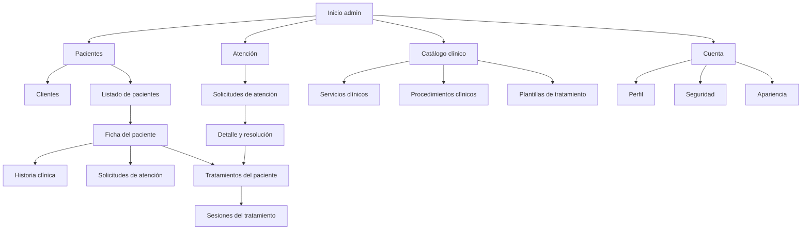
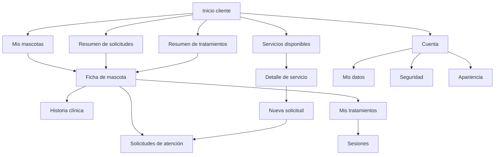
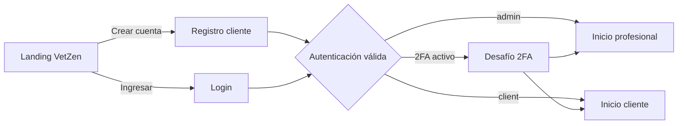
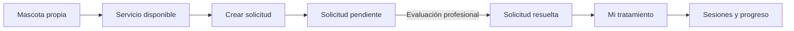
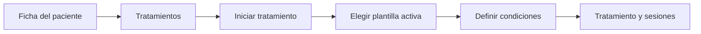

# VetZen - Especificación funcional y UX del rediseño del panel

## 1. Estado y alcance

Este documento define la experiencia objetivo del panel de VetZen para los roles actuales `admin` y `client`. Es un contrato funcional y UX: no cambia rutas, modelos, tablas, permisos ni reglas de negocio por sí mismo.

Fuentes revisadas:

- `AGENTS.md`.
- `spec.md`, `technical.md` y `features.md`.
- `features/05-Pets.md`, `features/06-MedicalRecords.md`, `features/07-services.md` y `features/08-treatments-and-sessions.md`.
- `doc/ux/current-panel-audit.md`.
- Rutas, controladores y frontend existentes al momento de redactar esta especificación.

La implementación debe conservar las reglas de autorización y ownership del backend. Ocultar una acción o sección en React nunca sustituye middleware, Policies, Form Requests ni consultas acotadas.

### 1.1 Alcance incluido

- Navegación y vocabulario por rol.
- Inicio administrativo y de cliente.
- Clientes, pacientes y mascotas.
- Historia clínica contextual al paciente.
- Servicios, procedimientos y plantillas de tratamiento.
- Solicitudes de atención.
- Tratamientos de pacientes y sesiones.
- Cuenta, autenticación, landing, responsive y accesibilidad.
- Estados de interfaz, formularios, filtros, paginación y confirmaciones.

### 1.2 Fuera de alcance

No deben aparecer en la navegación ni presentarse como disponibles:

- Agenda, turnos o calendario.
- Gestión de profesionales.
- Gestión de roles o permisos.
- Configuración general de la veterinaria.
- Notificaciones, pagos, facturación o inventario.
- Asistente virtual.
- Eliminación o archivado de mascotas.
- Eliminación de historia clínica.
- Roles diferentes de `admin` y `client`.
- Cambios de nombres técnicos, modelos o tablas.

## 2. Objetivos y principios

### 2.1 Objetivos

1. Convertir el panel en una herramienta orientada a tareas y no en una exposición del modelo de datos.
2. Separar con claridad pacientes, atención y catálogo clínico.
3. Diferenciar una plantilla reutilizable de un tratamiento concreto de un paciente.
4. Mantener el contexto de paciente, servicio, solicitud o tratamiento durante cada flujo.
5. Dar al cliente un recorrido continuo desde su mascota hasta la solicitud y el seguimiento.
6. Presentar toda la interfaz en español y retirar contenido del starter kit.
7. Hacer utilizables las pantallas en móvil sin limitarse a recortar tablas.
8. Reutilizar la arquitectura React/Inertia, Wayfinder, Tailwind y componentes existentes.

### 2.2 Principios de experiencia

- Cada pantalla tiene un propósito y una acción primaria como máximo.
- El nombre de un recurso enlaza a su detalle cuando existe un detalle útil.
- Los conteos son información; no son el enlace principal de una fila.
- Los cambios de estado usan el mismo control visual que muestra el estado cuando resulte comprensible y accesible.
- Las acciones sensibles explican consecuencias y solicitan confirmación.
- Las acciones infrecuentes se agrupan en un menú contextual.
- Los iconos sin texto requieren significado inequívoco, tooltip y nombre accesible.
- Las páginas anidadas muestran siempre el recurso padre y una salida predecible.
- Las acciones disponibles reflejan capacidades reales del backend.
- Los estados no se muestran como tokens técnicos en inglés.
- El feedback de éxito no reemplaza la actualización visible del recurso.
- La interfaz prioriza lectura rápida, trazabilidad y prevención de errores.

## 3. Decisiones definitivas de vocabulario

| Concepto técnico o nombre actual | Administrador            | Cliente                     | Regla de uso                                    |
| -------------------------------- | ------------------------ | --------------------------- | ----------------------------------------------- |
| Dashboard                        | Inicio                   | Inicio                      | Nunca mostrar “Dashboard”                       |
| Client                           | Cliente / responsable    | Mis datos                   | “Responsable” cuando se vincula con un paciente |
| Pet                              | Paciente                 | Mascota / Mis mascotas      | En admin se usa siempre “Paciente”              |
| Medical records                  | Historia clínica         | Historia clínica            | En singular para la sección del paciente        |
| Service                          | Servicio clínico         | Servicio disponible         | No implica turno ni tratamiento                 |
| Procedure                        | Procedimiento clínico    | Procedimiento               | Duración siempre “orientativa”                  |
| Treatment                        | Plantilla de tratamiento | No se expone como selección | Recurso reutilizable del catálogo               |
| PetTreatment                     | Tratamiento del paciente | Mi tratamiento              | Instancia con condiciones, progreso y sesiones  |
| ServiceRequest                   | Solicitud de atención    | Solicitud de atención       | No llamar turno, consulta ni tratamiento        |
| TreatmentSession                 | Sesión del tratamiento   | Sesión                      | No equivale a un turno                          |
| pending                          | Pendiente                | Pendiente                   | Etiqueta localizada                             |
| resolved                         | Resuelta                 | Resuelta                    | Debe enlazar al tratamiento creado              |
| in_progress                      | En curso                 | En curso                    | No mostrar token técnico                        |
| completed                        | Completado               | Completado                  | Estado final según reglas actuales              |
| suspended                        | Suspendido               | Suspendido                  | Puede reanudarse por admin                      |
| cancelled                        | Cancelado/a              | Cancelado/a                 | Concordar con el recurso                        |
| Settings                         | Cuenta                   | Cuenta                      | No usar “Configuración general”                 |
| Profile                          | Perfil                   | Mis datos                   | Identidad y datos personales deben explicarse   |
| Security                         | Seguridad                | Seguridad                   | Contraseña, 2FA y passkeys                      |
| Appearance                       | Apariencia               | Apariencia                  | Tema visual                                     |

No se cambian nombres de clases, propiedades, rutas, tablas ni modelos. Esta tabla define solo el lenguaje visible.

## 4. Arquitectura de información definitiva

### 4.1 Administrador

- **Inicio**
- **Pacientes**
- Clientes
- Pacientes
- **Atención**
- Solicitudes de atención
- **Catálogo clínico**
- Servicios clínicos
- Procedimientos clínicos
- Plantillas de tratamiento
- **Cuenta**
- Perfil
- Seguridad
- Apariencia

Historia clínica, solicitudes, tratamientos y sesiones se alcanzan dentro de la ficha del paciente. No se añaden “Tratamientos de pacientes” ni “Sesiones” a la navegación primaria en la primera versión: ambos recursos requieren el contexto del paciente y del tratamiento. Las solicitudes resueltas también enlazan al tratamiento creado.

### 4.2 Cliente

- **Inicio**
- **Mis mascotas**
- **Servicios disponibles**
- **Cuenta**
- Mis datos
- Seguridad
- Apariencia

En la primera versión no existen entradas globales “Mis solicitudes” ni “Mis tratamientos”. Inicio muestra resúmenes autorizados y cada mascota concentra la navegación hacia sus solicitudes, tratamientos y sesiones.

### 4.3 Mapa de navegación





## 5. Navegación, contexto y regreso

### 5.1 Escritorio

El sidebar es persistente y colapsable. Presenta el logotipo VetZen, grupos con rótulo, estado activo y acceso de cuenta al pie. Se eliminan “Repository” y “Documentation”.

```text
┌──────────────────────┐
│ VetZen               │
├──────────────────────┤
│ Inicio               │
│                      │
│ PACIENTES            │
│   Clientes           │
│   Pacientes          │
│                      │
│ ATENCIÓN             │
│   Solicitudes        │
│                      │
│ CATÁLOGO CLÍNICO     │
│   Servicios          │
│   Procedimientos     │
│   Plantillas         │
├──────────────────────┤
│ Usuario · Cuenta     │
└──────────────────────┘
```

### 5.2 Móvil

La navegación primaria se abre en un drawer desde un botón con nombre accesible “Abrir menú”. El encabezado conserva el nombre de la pantalla y una sola acción principal. No se replica toda la navegación en una barra inferior porque la cantidad y profundidad de destinos varía por rol.

```text
┌──────────────────────────┐
│ ☰  VetZen       Cuenta   │
├──────────────────────────┤
│ Pacientes                │
│ Información de apoyo     │
│                          │
│ [Nuevo paciente]         │
│                          │
│ Contenido adaptado       │
└──────────────────────────┘

Drawer
┌──────────────────────────┐
│ VetZen               [×] │
│ Inicio                   │
│ Pacientes                │
│ Atención                 │
│ Catálogo clínico         │
│ Cuenta                   │
└──────────────────────────┘
```

### 5.3 Breadcrumbs

- Listado: `Inicio / Pacientes`.
- Paciente: `Pacientes / Mora`.
- Historia: `Pacientes / Mora / Historia clínica`.
- Registro: `Pacientes / Mora / Historia clínica / Control de movilidad`.
- Plantilla: `Catálogo clínico / Plantillas / Nombre`.
- Solicitud: `Atención / Solicitudes / Solicitud #123`.
- Tratamiento: `Pacientes / Mora / Tratamientos / Nombre`.

El primer segmento siempre es un enlace. El recurso actual no lo es. En móvil puede reducirse a “Volver a Mora” sin perder un `aria-label` que describa el destino.

### 5.4 Conservación de contexto

- Volver desde un detalle restaura búsqueda, filtros y página mediante query string o navegación Inertia conservada.
- Un alta o edición cancelada vuelve al recurso padre, no a un listado global arbitrario.
- Las pantallas clínicas muestran una cabecera compacta con paciente, especie, responsable y foto si existe.
- Las pantallas del catálogo contextual muestran el servicio propietario.
- Una solicitud resuelta enlaza directamente al tratamiento creado.
- Un tratamiento originado por solicitud enlaza de regreso a esa solicitud cuando el backend entrega la relación.

## 6. Flujos de entrada

### 6.1 Registro, login y dashboard



La landing explica qué permite VetZen sin prometer módulos no implementados. Login, registro, recuperación y 2FA usan marca VetZen, textos en español y diseño móvil sin ancho o padding fijo que cause overflow.

El rol determina el dashboard y la navegación: `admin` recibe la experiencia profesional y `client` la experiencia cliente. Los permisos controlan las capacidades disponibles dentro de la experiencia correspondiente. El sidebar y `DashboardController` deben aplicar esta misma regla; actualmente usan fuentes diferentes y deben alinearse antes de implementar los dashboards.

La verificación de correo no es obligatoria en la etapa actual porque el sistema utiliza cuentas de prueba y no dispone de correo saliente configurado. Su infraestructura se conserva fuera del flujo normal: el panel exige autenticación sin middleware `verified`, `User` no implementa `MustVerifyEmail` y Fortify mantiene sus rutas para preservar la pantalla y los tipos Wayfinder existentes. El registro no envía verificación automáticamente. Una reactivación futura requiere proveedor real, decisión explícita y pruebas completas del flujo.

## 7. Flujos principales de atención

### 7.1 Cliente: mascota a sesiones



1. El cliente abre una mascota o un servicio disponible.
2. Si parte del servicio, elige una mascota propia; si parte de la mascota, el contexto ya está fijado.
3. Revisa servicio, mascota y el significado de la solicitud.
4. Añade una nota opcional y envía.
5. Ve la solicitud pendiente sin selector de plantilla ni promesa de turno.
6. Cuando se resuelve, la solicitud ofrece “Ver tratamiento”.
7. El tratamiento muestra condiciones, procedimientos acordados, progreso y sesiones en lectura.

### 7.2 Admin: solicitud a sesiones

```mermaid
flowchart LR
    P[Solicitud pendiente] --> E[Revisar paciente y servicio]
    E --> T[Elegir plantilla compatible]
    T --> C[Definir condiciones]
    C --> X[Confirmar resolución]
    X --> PT[Tratamiento del paciente]
    PT --> S[Gestionar sesiones]
    S -->|Completada| EV[Ofrecer registrar evolución]
```



1. Admin abre una solicitud pendiente desde Atención o la ficha del paciente.
2. La pantalla conserva paciente, responsable, servicio y nota del cliente.
3. Admin elige una plantilla activa compatible con el servicio.
4. Define sesiones previstas, precio por sesión, moneda, inicio, estado y notas.
5. Antes de enviar se explica que se creará el tratamiento, sus sesiones y se resolverá la solicitud en una única operación.
6. Tras el éxito, se navega al tratamiento creado.
7. Al completar una sesión se ofrece “Registrar evolución clínica”. La acción abre el alta con paciente y tipo “Evolución” preseleccionados, sin obligación, creación automática ni relación persistente entre sesión y registro.

Si no existen plantillas compatibles, el estado vacío explica el motivo y enlaza a “Crear plantilla para este servicio”. La solicitud permanece pendiente.

### 7.3 Asignación directa alternativa



La acción se mantiene para admin. Debe llamarse “Iniciar tratamiento” y no “Asignar plantilla”. El formulario aclara que no se vinculará una solicitud de atención. No se presenta como acción primaria global: vive en la sección Tratamientos del paciente.

## 8. Jerarquía de acciones

| Nivel      | Uso                                  | Ejemplos                                                                 | Presentación                         |
| ---------- | ------------------------------------ | ------------------------------------------------------------------------ | ------------------------------------ |
| Primaria   | Completa el propósito principal      | Nuevo paciente, Solicitar atención, Crear plantilla, Registrar evolución | Botón sólido, uno por encabezado     |
| Secundaria | Apoya sin cerrar el flujo            | Editar, Ver historia, Limpiar filtros, Cancelar formulario               | Botón secundario o enlace claro      |
| Contextual | Acción infrecuente sobre un registro | Cambiar estado, Ver responsable, Reanudar                                | Menú de acciones o control de estado |
| Sensible   | Tiene consecuencias relevantes       | Cancelar solicitud, cancelar tratamiento, cancelar sesión, eliminar foto | Estilo destructivo y confirmación    |

Los estados interactivos deben comunicar que son controles. El color nunca es el único indicador. Un registro inactivo sigue siendo consultable históricamente, pero no elegible en altas nuevas.

## 9. Especificación de pantallas

### 9.1 Matriz general

| Pantalla | Rol | Propósito | Información | Acción primaria | Acciones secundarias | Filtros | Estados | Navegación siguiente |
| --- | --- | --- | --- | --- | --- | --- | --- | --- | --- |
| Inicio profesional | admin | Priorizar trabajo actual | Solicitudes pendientes, pacientes recientes y accesos rápidos con datos disponibles | Revisar solicitudes | Ver pacientes, ver catálogo | No | Carga, vacío, error parcial | Solicitudes o paciente |
| Inicio cliente | client | Resumir su relación con VetZen | Mascotas, solicitudes pendientes, tratamientos activos | Ver mis mascotas | Ver servicios, solicitudes y tratamientos | No | Sin mascotas, sin actividad, carga | Mascota o servicio |
| Clientes | admin | Localizar responsables | Nombre, contacto y cantidad de pacientes si backend la provee | Ninguna o alta futura no visible | Abrir/editar cliente | Búsqueda; paginación dependiente | Vacío, sin resultados, error | Cliente o pacientes |
| Pacientes | admin | Localizar y administrar pacientes | Nombre, especie, responsable, datos resumidos | Nuevo paciente | Abrir, editar | Búsqueda, responsable, especie; paginación dependiente | Vacío, sin resultados | Ficha del paciente |
| Ficha de paciente | admin | Centralizar contexto clínico y operativo | Resumen, responsable, accesos a historia, solicitudes y tratamientos | Acción contextual de sección | Editar paciente | No | Carga, error, sección vacía | Historia, solicitud o tratamiento |
| Mis mascotas | client | Administrar mascotas propias | Foto, nombre, especie y datos básicos | Nueva mascota | Abrir, editar | Búsqueda local solo si aporta valor | Sin mascotas, carga | Ficha de mascota |
| Ficha de mascota | client | Acceder a toda su información permitida | Resumen, historia, solicitudes y tratamientos | Solicitar atención | Editar mascota | No | Secciones vacías | Flujo elegido |
| Historia clínica | admin | Consultar cronología y registrar información | Fecha, tipo, título, autor, visibilidad | Nuevo registro | Abrir, editar | Tipo y rango de fecha si backend existe | Vacío, carga, error | Registro clínico |
| Historia clínica | client | Consultar historia de mascota propia | Cronología completa según decisión confirmada | Ninguna | Abrir registro | Tipo/fecha solo si volumen lo requiere | Vacío, carga, acceso denegado | Registro clínico |
| Servicios clínicos | admin | Gestionar áreas terapéuticas | Nombre, descripción resumida, estado | Nuevo servicio | Editar, cambiar estado, abrir contexto | Búsqueda/estado dependientes | Vacío, sin resultados | Procedimientos o plantillas |
| Procedimientos clínicos | admin | Gestionar técnicas | Nombre, servicio, duración orientativa, estado | Nuevo procedimiento en contexto | Editar, cambiar estado | Búsqueda, servicio, estado, página | Vacío, sin resultados | Edición o servicio |
| Plantillas de tratamiento | admin | Gestionar configuraciones reutilizables | Nombre, servicio, procedimientos, sesiones estimadas, estado | Nueva plantilla | Editar, cambiar estado | Búsqueda, servicio, estado dependientes | Vacío, sin resultados | Crear/editar plantilla |
| Servicios disponibles | client | Comprender opciones de atención | Nombre, descripción, procedimientos activos | Solicitar atención | Ver detalle | Búsqueda solo si backend la incorpora | Sin servicios, carga | Elegir mascota / solicitud |
| Solicitudes de atención | admin | Revisar y resolver solicitudes | Paciente, responsable, servicio, fecha, estado | Ninguna global | Abrir, cancelar pendiente | Búsqueda, estado, servicio, página | Vacío, sin resultados | Detalle de solicitud |
| Solicitud de atención | admin | Evaluar y resolver una solicitud | Contexto completo, nota, plantillas compatibles | Aprobar e iniciar tratamiento | Cancelar, volver al paciente | No | Sin plantillas, resuelta, cancelada, error | Tratamiento creado |
| Solicitudes de la mascota | client | Consultar solicitudes en contexto | Servicio, fecha y estado | Nueva solicitud | Abrir, ver tratamiento resuelto | Estado si el volumen lo requiere | Vacío, sin resultados | Detalle o tratamiento |
| Nueva solicitud | client | Solicitar evaluación para un servicio | Mascota, servicio, explicación, nota | Enviar solicitud | Cancelar | No | Error de validación, procesando, éxito | Detalle de solicitud |
| Tratamientos del paciente | admin | Consultar y crear asignaciones | Nombre snapshot, progreso, inicio, estado | Iniciar tratamiento | Abrir | Estado dependiente | Vacío | Tratamiento |
| Tratamiento del paciente | admin | Gestionar condiciones y sesiones | Snapshots, condiciones, progreso, sesiones | Guardar cambios si está editando | Estado, volver, registrar evolución desde sesión | No | Suspendido, cancelado, completado, error | Sesión o historia |
| Tratamientos de la mascota | client | Consultar tratamientos en contexto | Nombre, progreso y estado | Ninguna | Abrir | Estado si el volumen lo requiere | Vacío, carga | Tratamiento |
| Mi tratamiento | client | Comprender plan y progreso | Descripción snapshot, procedimientos, condiciones y sesiones | Ninguna | Volver a mascota/solicitud | No | Sin sesiones, carga, error | Detalle contextual |
| Cuenta | ambos | Administrar información propia | Datos de identidad o cliente según rol | Guardar cambios | Navegar Seguridad/Apariencia | No | Éxito, error, procesando | Misma sección |
| Seguridad | ambos | Proteger acceso | Contraseña, 2FA, passkeys, sesiones si existen | Acción de cada bloque | Recuperación, códigos | No | Confirmación, error | Misma sección |
| Apariencia | ambos | Elegir tema | Claro, oscuro, sistema | Seleccionar tema | Ninguna | No | Seleccionado | Misma sección |

### 9.2 Inicio profesional

Debe priorizar acciones reales, no métricas decorativas. Primera versión recomendada:

- Solicitudes pendientes: conteo y hasta cinco registros recientes, cada nombre de paciente enlazado.
- Accesos rápidos: Nuevo paciente, Ver solicitudes y Abrir catálogo.
- Actividad reciente solo si el backend puede definirla sin consultas ambiguas.

No mostrar “Próximas sesiones” hasta definir si incluye sesiones sin `scheduled_at`, zona horaria, horizonte y orden. Si no existe endpoint de datos, el dashboard puede comenzar con accesos rápidos y un bloque de solicitudes respaldado por consulta explícita.

```text
┌────────────────────────────────────────────────────────┐
│ Inicio                              [Nuevo paciente]    │
│ Lo importante para continuar la atención               │
├──────────────────────┬─────────────────────────────────┤
│ Solicitudes          │ Accesos rápidos                 │
│ 4 pendientes         │ Pacientes · Catálogo            │
├──────────────────────┴─────────────────────────────────┤
│ Solicitudes recientes                                  │
│ Mora · Fisioterapia · Pendiente        [Abrir]         │
│ Simón · Acupuntura · Pendiente          [Abrir]         │
└────────────────────────────────────────────────────────┘
```

### 9.3 Inicio cliente

Debe dejar de duplicar el formulario de datos personales. Resume mascotas y actividad:

- Tarjetas de mascotas con acceso a ficha.
- Solicitudes pendientes con estado y servicio.
- Tratamientos activos con progreso.
- Acción “Explorar servicios”.

Si no tiene mascotas, el estado vacío concentra la acción “Registrar mi primera mascota”; solicitar atención permanece deshabilitado hasta completar ese paso.

```text
┌──────────────────────────────────────────────────────┐
│ Hola, Ana                         [Explorar servicios]│
│ Seguimiento de tus mascotas                          │
├──────────────────────────────────────────────────────┤
│ Mis mascotas                                         │
│ [Mora · Canina] [Simón · Felina]                     │
├──────────────────────────┬───────────────────────────┤
│ Solicitudes pendientes   │ Tratamientos activos     │
│ Fisioterapia · Mora      │ Mora · 2 de 6 sesiones   │
└──────────────────────────┴───────────────────────────┘
```

### 9.4 Listado y ficha de paciente

En desktop, listado tabular; en móvil, tarjetas que conservan nombre, especie, responsable y acción principal. La ficha utiliza cabecera persistente y subnavegación de Resumen, Historia clínica, Solicitudes y Tratamientos.

```text
Listado
┌────────────────────────────────────────────────────────┐
│ Pacientes                           [Nuevo paciente]    │
│ [Buscar paciente o responsable...] [Especie ▾]         │
├────────────────────────────────────────────────────────┤
│ Paciente       Especie       Responsable       Acciones│
│ Mora →         Canina        Ana Pérez          [···]   │
└────────────────────────────────────────────────────────┘

Ficha
┌────────────────────────────────────────────────────────┐
│ ‹ Pacientes                                            │
│ [Foto] Mora · Canina      Responsable: Ana Pérez       │
│                         [Editar paciente]               │
├────────────────────────────────────────────────────────┤
│ Resumen | Historia clínica | Solicitudes | Tratamientos│
├────────────────────────────────────────────────────────┤
│ Información de la sección activa                       │
└────────────────────────────────────────────────────────┘
```

Las pestañas pueden ser enlaces Inertia a rutas existentes, no estado local que oculte URLs profundas.

### 9.5 Historia clínica

La vista es una cronología, no una tabla densa. Cada entrada muestra fecha clínica, tipo localizado, título, autor y visibilidad solo para admin. El contenido completo aparece en el detalle.

```text
┌──────────────────────────────────────────────────────┐
│ Mora / Historia clínica          [Nuevo registro]    │
│ [Tipo ▾] [Desde] [Hasta]                             │
├──────────────────────────────────────────────────────┤
│ 28 ago 2026 · Evolución · Visible para cliente       │
│ Mejor respuesta de movilidad                    →    │
│ Dra. Laura                                           │
│                                                      │
│ 14 ago 2026 · Evaluación                        →    │
│ Evaluación inicial                                   │
└──────────────────────────────────────────────────────┘
```

Decisión de producto definitiva: el cliente consulta toda la historia clínica de sus mascotas. Antes de implementar esta pantalla se deben actualizar Feature 06, las consultas, la autorización y las pruebas, porque el contrato y backend vigentes filtran `is_visible_to_client`. El cambio debe conservar la restricción completa `User → Client → Pet → ClinicalRecord` y el modo de solo lectura del cliente.

### 9.6 Catálogo de servicios

Admin ve una tabla operativa; cliente ve tarjetas descriptivas. En cliente, cada servicio activo ofrece “Solicitar atención”, que abre un selector de mascota si no existe contexto previo.

```text
Cliente
┌──────────────────────────────────────────────────────┐
│ Servicios disponibles                               │
│ Opciones para solicitar una evaluación profesional  │
├──────────────────────┬───────────────────────────────┤
│ Fisioterapia         │ Acupuntura                    │
│ Descripción breve    │ Descripción breve             │
│ Ver detalles         │ Ver detalles                  │
│ [Solicitar atención] │ [Solicitar atención]          │
└──────────────────────┴───────────────────────────────┘
```

Un servicio sin procedimientos activos no rompe el detalle. Explica “Este servicio todavía no tiene procedimientos publicados” y mantiene o deshabilita la solicitud según la regla backend del servicio activo; no inventa una restricción adicional.

### 9.7 Solicitudes de atención

El listado admin renderiza la paginación que el backend ya entrega. El detalle separa información de solicitud y formulario de resolución. Una solicitud resuelta reemplaza el formulario por un resumen enlazado al tratamiento. Una cancelada explica que permanece como historial.

```text
┌──────────────────────────────────────────────────────┐
│ Solicitudes de atención                             │
│ [Buscar...] [Estado ▾] [Servicio ▾] [Limpiar]       │
├──────────────────────────────────────────────────────┤
│ Mora →  Fisioterapia  29 ago 2026  [Pendiente] [···]│
│ Simón → Acupuntura    27 ago 2026  [Resuelta]  [···]│
├──────────────────────────────────────────────────────┤
│ ‹ Anterior                          Siguiente ›       │
└──────────────────────────────────────────────────────┘

Detalle pendiente
┌──────────────────────┬───────────────────────────────┐
│ Solicitud            │ Iniciar tratamiento           │
│ Mora · Ana Pérez     │ Plantilla compatible [▾]      │
│ Fisioterapia         │ Sesiones [6] Precio [____]    │
│ Nota del cliente     │ Inicio [____] Notas [____]    │
│ [Cancelar solicitud] │ [Aprobar e iniciar]           │
└──────────────────────┴───────────────────────────────┘
```

La cancelación administrativa usa confirmación y no solicita motivo. Si en una versión futura se requiere conservar motivo, actor explícito o fecha separada de `updated_at`, primero debe ampliarse el contrato de persistencia.

### 9.8 Plantillas de tratamiento

El listado global muestra nombre como enlace contextual de edición o detalle útil, servicio enlazado, número de procedimientos, sesiones estimadas y estado. Corrige la desalineación actual del listado por servicio.

```text
┌────────────────────────────────────────────────────────┐
│ Plantillas de tratamiento           [Nueva plantilla]  │
│ [Buscar...] [Servicio ▾] [Estado ▾]                    │
├────────────────────────────────────────────────────────┤
│ Plantilla → Servicio  Procedimientos  Sesiones  Estado │
│ Inicial     Fisio     3               6         Activa │
└────────────────────────────────────────────────────────┘
```

Si un servicio no tiene procedimientos activos, el alta muestra un estado bloqueado con “Crear procedimiento” como siguiente paso. No muestra un formulario imposible de enviar.

### 9.9 Tratamiento del paciente y sesiones

La cabecera muestra nombre snapshot, estado y progreso. Las condiciones acordadas y los procedimientos snapshot son de lectura clara. Admin edita solo campos permitidos por estado. Cliente no ve controles.

```text
┌────────────────────────────────────────────────────────┐
│ Mora / Fisioterapia inicial          [En curso]        │
│ Progreso: 2 de 6 sesiones  [██████░░░░░░░░░░]         │
├──────────────────────┬─────────────────────────────────┤
│ Condiciones          │ Procedimientos acordados       │
│ Inicio · Precio      │ Lámpara · Masoterapia          │
│ Moneda · Notas       │ Electroterapia                 │
├──────────────────────┴─────────────────────────────────┤
│ Sesiones                                               │
│ #1  20 ago · Completada · ARS 18.000    [Editar]      │
│ #2  27 ago · Completada · ARS 18.000    [Editar]      │
│ #3  Sin programar · Pendiente · ARS 18.000 [Editar]   │
└────────────────────────────────────────────────────────┘
```

Gestión de una sesión:

```text
┌──────────────────────────────────────┐
│ Sesión 3 de Mora                     │
│ Fecha y hora  [dd/mm/aaaa --:--]     │
│ Precio       [__________] ARS        │
│ Estado       [Pendiente ▾]           │
│ Notas        [__________________]    │
│ [Descartar]              [Guardar]   │
└──────────────────────────────────────┘
```

Requisitos:

- `scheduled_at` usa fecha y hora, no solo fecha.
- Todos los controles tienen etiqueta, ayuda y error de campo.
- Cancelar sesión confirma que el registro se conservará y puede generarse un reemplazo con numeración nueva.
- Las cancelaciones no solicitan motivo mientras el backend no tenga persistencia para conservarlo.
- Cancelar tratamiento explica que no podrá reabrirse.
- Un tratamiento suspendido ofrece reanudar; uno cancelado queda en lectura.
- Un tratamiento completado es final y no permite aumentar sesiones. Si continúa la atención, admin inicia un nuevo tratamiento.
- Al completar una sesión, el éxito ofrece “Registrar evolución clínica” y “Continuar en tratamiento”. La primera acción abre el alta con paciente y tipo “Evolución” preseleccionados; no crea el registro automáticamente, no es obligatoria y no persiste una relación con la sesión.

### 9.10 Cuenta

La navegación de Cuenta es consistente para ambos roles y no mezcla configuración general de VetZen.

```text
┌──────────────────────────────────────────────────────┐
│ Cuenta                                               │
│ Mis datos | Seguridad | Apariencia                   │
├──────────────────────────────────────────────────────┤
│ Datos de acceso                                     │
│ Nombre [________] Correo [____________]             │
│                                                     │
│ Datos personales del cliente                       │
│ Teléfono [____] Dirección [________________]        │
│                                      [Guardar]      │
└──────────────────────────────────────────────────────┘
```

La UI puede componer identidad `User` y perfil `Client` en una experiencia, pero cada bloque conserva su endpoint, validación y feedback. Si no puede garantizar guardado atómico, no usa un único botón que aparente atomicidad. La eliminación de cuenta permanece oculta hasta definir una política de retención o anonimización compatible con los datos clínicos y las foreign keys restrictivas.

## 10. Estados de interfaz

| Estado              | Comportamiento requerido                                                  |
| ------------------- | ------------------------------------------------------------------------- |
| Vacío inicial       | Explica qué recurso falta y ofrece un siguiente paso permitido            |
| Sin resultados      | Conserva filtros, indica que no hubo coincidencias y permite limpiarlos   |
| Carga               | Skeleton con forma aproximada al contenido; evita saltos grandes          |
| Envío               | Deshabilita repetición, conserva contenido y muestra verbo en progreso    |
| Error de validación | Mensaje junto al campo y resumen enfocado si hay varios errores           |
| Error de página     | Explica que no se pudo cargar y ofrece reintentar o volver                |
| Error parcial       | Conserva bloques disponibles e identifica solo el bloque fallido          |
| Éxito               | Toast o mensaje breve, actualización visible y navegación predecible      |
| Acceso denegado     | Título claro, sin filtrar datos del recurso, enlace a Inicio              |
| No encontrado       | Diferenciado de acceso denegado solo según respuesta backend              |
| Inactivo            | Sigue visible históricamente; explica que no puede seleccionarse en altas |

Mensajes vacíos mínimos:

- Sin mascotas: “Todavía no registraste mascotas.” / “Registrar mascota”.
- Sin historia: “No hay registros clínicos para este paciente.”
- Sin solicitudes: “No hay solicitudes de atención.” / cliente: “Explorar servicios”.
- Sin procedimientos: “Este servicio aún no tiene procedimientos.” / admin: “Crear procedimiento”.
- Sin plantillas compatibles: “No hay plantillas activas para este servicio.” / “Crear plantilla”.
- Sin tratamientos: “Este paciente todavía no tiene tratamientos.” / admin: “Iniciar tratamiento”.
- Sin sesiones: estado anómalo; indicar error y no presentar progreso engañoso.

## 11. Búsqueda, filtros y paginación

- La búsqueda se ejecuta en backend cuando el conjunto es global o paginado.
- Los filtros usan query parameters, omiten valores vacíos y reinician `page` al cambiar.
- La paginación conserva filtros válidos.
- “Limpiar filtros” aparece solo cuando alguno está activo.
- La UI distingue catálogo vacío de búsqueda sin coincidencias.
- Los filtros aplicados se anuncian y son removibles en móvil.
- No se agrega búsqueda solo por simetría si el volumen actual no lo justifica.

Prioridad:

1. Reutilizar el patrón ya implementado en `/admin/procedures`.
2. Renderizar paginación existente en solicitudes admin.
3. Añadir backend de búsqueda/paginación para pacientes, clientes, servicios y plantillas antes de exponer esos controles.
4. Mantener solicitudes y tratamientos contextualizados por mascota o paciente; los resúmenes de Inicio enlazan a ese contexto.

## 12. Responsive

Puntos de validación mínimos: 320, 375, 390, 768 y 1280 px.

- Los encabezados apilan texto y acción en móvil.
- Los formularios pasan a una columna manteniendo agrupación semántica.
- Las tablas operativas breves pueden desplazarse horizontalmente si mantienen encabezados y acciones visibles.
- Pacientes, solicitudes, tratamientos y sesiones se transforman en tarjetas en móvil porque su lectura depende de varias relaciones.
- Las columnas secundarias se trasladan al detalle o menú; no se ocultan datos críticos como nombre, estado o acción principal.
- Los controles táctiles tienen al menos 44 por 44 px.
- Ningún layout de autenticación usa padding fijo que cause overflow a 320 px.
- Modales largos pasan a drawer o pantalla completa móvil con acciones persistentes.
- El sidebar móvil cierra al navegar y restaura foco en el disparador.

## 13. Formularios y mensajes

### 13.1 Reglas generales

- Etiqueta visible para cada campo; placeholder no sustituye etiqueta.
- Ayuda previa para consecuencias o formatos difíciles.
- Campos requeridos identificados en texto y semántica.
- Errores backend junto al campo correspondiente.
- Primer error recibe foco después del envío.
- El botón principal usa un verbo específico: Guardar cambios, Crear plantilla, Enviar solicitud.
- “Cancelar” significa abandonar cambios y volver; para cambios de estado se usa el verbo del recurso.
- Formularios extensos se agrupan por significado, no en grids sin rótulos.
- Valores monetarios se muestran como ARS y se envían en formato compatible con decimal backend.
- Fechas visibles siguen formato local; los controles conservan valores técnicos válidos.

### 13.2 Confirmaciones

| Acción               | Confirmación mínima                                                  |
| -------------------- | -------------------------------------------------------------------- |
| Desactivar catálogo  | Deja de estar disponible para nuevas selecciones; conserva historial |
| Cancelar solicitud   | La solicitud queda como historial y no puede resolverse              |
| Resolver solicitud   | Crea tratamiento y sesiones, y marca la solicitud como resuelta      |
| Cancelar sesión      | Conserva la sesión y puede crear un reemplazo con otro número        |
| Cancelar tratamiento | Detiene cambios y no puede reabrirse                                 |
| Eliminar foto        | Elimina solo la foto, no la mascota                                  |

Las cancelaciones no solicitan motivo mientras el backend no pueda persistirlo.

## 14. Accesibilidad

Objetivo recomendado: WCAG 2.2 nivel AA.

- Una sola `h1` visible por pantalla; subtítulos usan jerarquía descendente.
- Regiones `nav`, `main`, `header` y formularios identificables.
- Breadcrumbs con `aria-label="Migas de pan"` y página actual marcada.
- Iconos decorativos ocultos a tecnología asistiva.
- Iconos interactivos con nombre accesible y tooltip complementario.
- Estado, error y selección no dependen solo del color.
- Focus visible con contraste suficiente en tema claro y oscuro.
- Diálogos atrapan foco, cierran con Escape cuando es seguro y devuelven foco.
- Toasts importantes se anuncian sin interrumpir lectura; errores persistentes no viven solo en toast.
- Tablas tienen encabezados y nombre accesible para columna de acciones.
- Tarjetas enlazables no generan múltiples destinos superpuestos.
- Las pestañas que navegan entre URLs se implementan como enlaces; no simulan un widget tablist innecesario.
- Se prueba teclado, zoom 200 %, lector de pantalla básico y preferencias de movimiento reducido.

## 15. Componentes compartidos recomendados

| Componente              | Responsabilidad                                             | Base existente                |
| ----------------------- | ----------------------------------------------------------- | ----------------------------- |
| `PageHeader`            | `h1`, descripción, breadcrumbs y acción primaria responsive | `Heading`, `Breadcrumbs`      |
| `PatientHeader`         | Foto, paciente, especie, responsable y subnavegación        | `PetSummary`, `Avatar`        |
| `ContextHeader`         | Servicio, solicitud o tratamiento padre                     | Card, Breadcrumb              |
| `ResourceTable`         | Encabezados accesibles, filas, acciones y responsive        | tablas actuales               |
| `ResourceCards`         | Variante móvil de recursos densos                           | Card                          |
| `FilterBar`             | Búsqueda, selects, limpiar y filtros activos                | patrón de procedimientos      |
| `Pagination`            | Enlaces preservando query y estado deshabilitado            | patrón de procedimientos      |
| `StatusBadge`           | Traducción y semántica visual centralizada                  | Badge                         |
| `StatusAction`          | Estado interactivo con confirmación                         | `CatalogStatusForm`           |
| `EmptyState`            | Mensaje, explicación y siguiente paso                       | Card/Button                   |
| `ConfirmAction`         | Confirmación sensible y estado de envío                     | Dialog/Form                   |
| `FormActions`           | Guardar/cancelar consistentes y responsive                  | Button                        |
| `TreatmentSummary`      | Snapshot, condiciones y progreso                            | componentes de dominio nuevos |
| `SessionSummary`        | Número, fecha, precio, estado y notas                       | componentes de dominio nuevos |
| `ServiceRequestSummary` | Paciente, servicio, nota, estado y vínculo                  | componentes de dominio nuevos |

No se crea una biblioteca abstracta antes de usar estos patrones en dos pantallas reales. Los componentes se extraen de forma incremental cuando reducen duplicación concreta.

## 16. Dependencias y contradicciones detectadas

| Dependencia                                   | Estado                                | Impacto                                                                                                                    |
| --------------------------------------------- | ------------------------------------- | -------------------------------------------------------------------------------------------------------------------------- |
| Historia clínica completa para cliente        | Decidida; actualización requerida     | Actualizar Feature 06, consultas, autorización y pruebas para retirar el filtro de lectura cliente sin debilitar ownership |
| Rol para elegir dashboard y navegación        | Decidida; alineación requerida        | El rol elige experiencia; los permisos controlan capacidades internas. Sidebar y controlador deben aplicar la misma regla  |
| Infraestructura de verificación de correo     | Decidida; inactiva en esta etapa      | Conservar implementación sin bloquear el panel ni enviar correos hasta configurar proveedor y aprobar su reactivación      |
| Dashboard admin con solicitudes               | Backend requerido                     | Necesita props agregadas y pruebas; puede reutilizar modelos actuales                                                      |
| Dashboard cliente                             | Backend requerido                     | Necesita mascotas, solicitudes y tratamientos acotados por ownership                                                       |
| Listados globales de solicitudes/tratamientos | Fuera de alcance de v1                | Se usan resúmenes en Inicio y navegación contextual por mascota o paciente                                                 |
| Búsqueda/paginación de clientes y pacientes   | Backend requerido                     | Listados actuales cargan colecciones completas                                                                             |
| Filtros/paginación de plantillas/servicios    | Backend requerido                     | Solo deben mostrarse cuando exista soporte                                                                                 |
| Cancelaciones                                 | Decidida                              | Usan confirmación sin motivo hasta que exista soporte de persistencia                                                      |
| Evolución desde sesión completada             | Decidida; integración acotada         | Abre alta con paciente y tipo preseleccionados, sin relación persistente ni creación automática                            |
| Tratamiento completado                        | Decidida; actualización F08 requerida | Es final, no admite aumento de sesiones; una continuidad crea un nuevo tratamiento                                         |
| Eliminación de cuenta                         | Oculta                                | No se ofrece hasta definir retención o anonimización                                                                       |
| Archivo/eliminación de mascota                | Bloqueada                             | Decisión pendiente en Feature 05                                                                                           |

Corrección respecto del audit: las rutas administrativas están actualmente agrupadas bajo middleware de rol `admin`. Debe conservarse y complementarse con Policies/ownership; el rediseño no debe asumir que el hallazgo crítico de exposición sigue activo.

## 17. Estrategia de implementación incremental

Cada tarea debe cerrarse con verificación responsive, tipos, lint y tests relevantes. Los archivos son probables y deben confirmarse antes de editar.

### 17.1 Fundamentos y componentes compartidos

| Tarea                                 | Alcance                                                              | Archivos probables                                                                        | Dependencias                | Criterios de aceptación                                |
| ------------------------------------- | -------------------------------------------------------------------- | ----------------------------------------------------------------------------------------- | --------------------------- | ------------------------------------------------------ |
| F1. Inventario de tokens y primitives | Consolidar tipografía, espaciado, estados y foco sin cambiar dominio | `resources/css/app.css`, `resources/js/components/ui/*`                                   | Tailwind v4 y tema actual   | Claro/oscuro coherentes; sin utilidades obsoletas      |
| F2. Encabezado de página              | Crear patrón con `h1`, descripción, breadcrumb y acciones            | `components/page-header.tsx`, `components/heading.tsx`, `components/breadcrumbs.tsx`      | Ninguna backend             | Una `h1`; acciones apilan en móvil                     |
| F3. Estados compartidos               | Vacío, error, sin resultados, loading                                | `components/empty-state.tsx`, `components/page-error.tsx`, `components/ui/skeleton.tsx`   | Copy aprobado               | Acciones permitidas y accesibles                       |
| F4. Estado y confirmación             | Localizar estados y unificar acciones sensibles                      | `components/status-badge.tsx`, `components/confirm-action.tsx`, `catalog-status-form.tsx` | Mapas de estados existentes | Sin tokens ingleses; confirmación explica consecuencia |
| F5. Listados                          | Extraer filtros/paginación solo desde usos reales                    | `components/filter-bar.tsx`, `components/pagination.tsx`                                  | Query backend por pantalla  | Conserva filtros y distingue vacío/sin resultados      |

### 17.2 Navegación y vocabulario

| Tarea                   | Alcance                                            | Archivos probables                                                    | Dependencias                     | Criterios de aceptación                          |
| ----------------------- | -------------------------------------------------- | --------------------------------------------------------------------- | -------------------------------- | ------------------------------------------------ |
| N1. Sidebar por rol     | Grupos definitivos, español y sin enlaces starter  | `components/app-sidebar.tsx`, `nav-main.tsx`, `user-menu-content.tsx` | Regla coherente de rol/dashboard | Solo módulos implementados; activo correcto      |
| N2. Cuenta              | Renombrar destinos y evitar duplicación conceptual | `layouts/settings/layout.tsx`, `pages/settings/*`                     | Rutas settings actuales          | Cuenta/Mis datos/Seguridad/Apariencia en español |
| N3. Contexto profundo   | Breadcrumbs y regreso en páginas anidadas          | layouts y páginas de pets, records, requests, treatments              | Wayfinder                        | Regreso predecible; query preservada             |
| N4. Traducción completa | Formularios, botones, errores visibles y auth      | `resources/js/**/*`, mensajes backend afectados                       | Inventario de copy               | No queda copy visible en inglés                  |

### 17.3 Dashboards

| Tarea                   | Alcance                                        | Archivos probables                                                      | Dependencias                   | Criterios de aceptación                |
| ----------------------- | ---------------------------------------------- | ----------------------------------------------------------------------- | ------------------------------ | -------------------------------------- |
| D1. Inicio admin mínimo | Solicitudes pendientes y accesos rápidos       | `DashboardController.php`, `pages/admin/dashboard.tsx`, tests dashboard | Query autorizada; regla de rol | Datos accionables; estados vacío/error |
| D2. Inicio cliente      | Mascotas, solicitudes y tratamientos propios   | `DashboardController.php`, `pages/client/dashboard.tsx`, tests          | Ownership completo             | Nunca serializa datos de otro cliente  |
| D3. Optimización        | Cargas diferidas solo si medición lo justifica | controlador/pages dashboard                                             | Inertia vigente                | Sin N+1; skeleton de props diferidas   |

### 17.4 Pacientes e historia clínica

| Tarea                   | Alcance                             | Archivos probables                                                    | Dependencias                             | Criterios de aceptación                                 |
| ----------------------- | ----------------------------------- | --------------------------------------------------------------------- | ---------------------------------------- | ------------------------------------------------------- |
| P1. Listados responsive | Pacientes admin y mascotas cliente  | `pages/admin/pets/index.tsx`, `pages/pets/index.tsx`, componentes pet | Datos actuales                           | Tabla desktop, tarjetas móvil, nombres enlazados        |
| P2. Ficha contextual    | Cabecera y navegación por secciones | páginas `admin/pets/show.tsx`, `pets/show.tsx`, `pet-summary.tsx`     | Rutas existentes                         | Contexto visible en todas las subsecciones              |
| P3. Historia admin      | Cronología y formularios accesibles | páginas admin medical records y componentes clinical                  | Backend existente                        | Tipo localizado; visibilidad explicada                  |
| P4. Historia cliente    | Cumplir acceso completo confirmado  | controller/policy/request pages/tests/doc F06                         | Actualizar Feature 06 y contrato backend | Acceso completo propio y denegación horizontal probados |
| P5. Búsqueda/paginación | Escalar clientes y pacientes        | controladores admin, requests, pages, tests                           | Contrato query                           | Filtros backend y paginación conservada                 |

### 17.5 Catálogo clínico

| Tarea                        | Alcance                                              | Archivos probables                                          | Dependencias          | Criterios de aceptación                          |
| ---------------------------- | ---------------------------------------------------- | ----------------------------------------------------------- | --------------------- | ------------------------------------------------ |
| C1. Servicios                | Unificar listado admin y detalle cliente             | pages admin/services, pages/services, `service-details.tsx` | Rutas actuales        | Estado interactivo accesible; CTA cliente        |
| C2. Procedimientos           | Aplicar encabezados y responsive al patrón existente | pages admin/procedures y services/procedures                | Backend actual        | Filtros/paginación no regresan                   |
| C3. Plantillas               | Renombrar y corregir tabla contextual                | pages admin/treatments y services/treatments                | F08                   | Columnas alineadas; vacío guía a procedimiento   |
| C4. Solicitud desde servicio | Conservar servicio y seleccionar mascota propia      | service detail, request create, controllers/tests           | Props/queries seguras | No acepta mascota ajena; no muestra tratamientos |

### 17.6 Solicitudes

| Tarea                        | Alcance                                         | Archivos probables                                           | Dependencias                  | Criterios de aceptación                                |
| ---------------------------- | ----------------------------------------------- | ------------------------------------------------------------ | ----------------------------- | ------------------------------------------------------ |
| S1. Listado admin            | Copy, estado, paginación y responsive           | `pages/admin/service-requests/index.tsx`                     | Paginador actual              | Se navegan todas las páginas y filtros                 |
| S2. Detalle/resolución       | Separar resumen y formulario; todos los errores | `pages/admin/service-requests/show.tsx`, componentes summary | Servicio de resolución actual | Sin plantilla incompatible; éxito abre tratamiento     |
| S3. Cancelación admin        | Control sensible con consecuencia               | show admin, ruta Wayfinder, tests UI/HTTP                    | Backend actual sin motivo     | Solo pendiente; confirma y queda como historial        |
| S4. Flujo cliente contextual | Crear, listar, detalle y vínculo al tratamiento | pages pets/service-requests                                  | Backend actual                | Servicio y mascota claros; resuelta enlaza tratamiento |

### 17.7 Tratamientos y sesiones

| Tarea                  | Alcance                                          | Archivos probables                                        | Dependencias                  | Criterios de aceptación                                 |
| ---------------------- | ------------------------------------------------ | --------------------------------------------------------- | ----------------------------- | ------------------------------------------------------- |
| T1. Listado contextual | Tratamientos del paciente con progreso           | pages admin/pets/treatments/index y pets/treatments/index | Backend actual                | Vacío correcto; nombre enlaza detalle                   |
| T2. Alta directa       | Mantener flujo alternativo y explicar origen     | admin create treatment page                               | F08 actual                    | Solo plantilla activa; transacción intacta              |
| T3. Detalle admin      | Resumen, snapshots, condiciones y estados        | admin pets/treatments/show, componentes                   | Actualizar regla final de F08 | Completado es final; continuidad crea tratamiento nuevo |
| T4. Sesiones           | Fecha-hora, notas, errores y reemplazo explicado | admin treatment show/session components                   | Endpoint actual               | Labels; todos los errores; no duplica envíos            |
| T5. Evolución opcional | CTA posterior a completar sesión                 | session UI, ruta medical record create                    | Sin relación persistente      | Preselecciona paciente y evolución; puede omitirse      |
| T6. Lectura cliente    | Mostrar todos los props ya disponibles           | pets/treatments/show e index                              | Backend actual                | Snapshots, inicio, notas, programación y progreso       |

### 17.8 Cuenta, autenticación y landing

| Tarea                     | Alcance                                           | Archivos probables                                | Dependencias                | Criterios de aceptación                              |
| ------------------------- | ------------------------------------------------- | ------------------------------------------------- | --------------------------- | ---------------------------------------------------- |
| A1. Marca VetZen          | Reemplazar starter kit en landing/auth/logo       | `welcome.tsx`, layouts auth, logo                 | Copy institucional aprobado | Sin Laravel/repository copy visible                  |
| A2. Auth responsive       | Corregir overflow y traducir flujos               | pages auth, auth layouts                          | Fortify/passkeys actuales   | Funciona a 320 px y teclado                          |
| A3. Verificación          | Conservar infraestructura inactiva               | `User.php`, Fortify, config, routes, tests y docs | Proveedor de correo futuro  | Usuario no verificado accede; registro no envía email |
| A4. Cuenta compuesta      | Separar claramente identidad y perfil cliente     | settings pages/components/controllers             | Endpoints actuales          | Ninguna falsa atomicidad                             |
| A5. Eliminación de cuenta | Ocultar hasta política aprobada                   | `delete-user.tsx`, backend asociado               | Decisión de retención       | No ofrece acción que falle o elimine datos sensibles |

### 17.9 Responsive y accesibilidad

| Tarea                 | Alcance                                 | Archivos probables          | Dependencias          | Criterios de aceptación              |
| --------------------- | --------------------------------------- | --------------------------- | --------------------- | ------------------------------------ |
| R1. Matriz responsive | Validar cada pantalla objetivo          | todas las páginas afectadas | Implementación previa | Sin overflow a 320/375/390/768/1280  |
| R2. Teclado y foco    | Navegación, drawer, diálogos, errores   | layouts/components/pages    | Componentes finales   | Orden lógico y retorno de foco       |
| R3. Semántica         | Heading, tablas, formularios y regiones | componentes compartidos     | F2/F5                 | Una `h1`, labels, headers accesibles |
| R4. Tema y contraste  | Claro/oscuro y estados                  | CSS/componentes             | Tokens finales        | Contraste AA y foco visible          |

### 17.10 Pruebas y validación final

| Tarea                    | Alcance                                                     | Archivos probables                      | Dependencias          | Criterios de aceptación                            |
| ------------------------ | ----------------------------------------------------------- | --------------------------------------- | --------------------- | -------------------------------------------------- |
| Q1. Tests HTTP           | Props, rutas, autorización y ownership nuevos               | `tests/Feature/**/*`                    | Backend de cada etapa | Casos admin/client y horizontal auth pasan         |
| Q2. Tests frontend       | Interacciones sensibles y estados si existe infraestructura | tests frontend a definir                | Estrategia de testing | Confirmaciones, filtros y errores cubiertos        |
| Q3. Calidad              | Types, lint, formato, build y PHPUnit afectado              | scripts existentes                      | Cambios terminados    | Todos los comandos ejecutados con éxito            |
| Q4. Revisión UX          | Flujos completos por rol                                    | entorno local con datos representativos | Seeders/fixtures      | Registro a dashboard y ambos flujos sin callejones |
| Q5. Accesibilidad manual | Teclado, zoom, lector y contraste                           | checklist de QA                         | Build estable         | Sin bloqueos críticos WCAG AA                      |

## 18. Decisiones cerradas para la primera versión

1. El cliente consulta toda la historia clínica de sus mascotas en modo lectura. Feature 06, consultas, autorización y pruebas deben actualizarse antes de implementar esa experiencia.
2. La verificación de correo no es obligatoria en esta etapa; su infraestructura permanece inactiva hasta disponer de correo saliente y aprobar la reactivación.
3. El rol determina dashboard y navegación; los permisos controlan capacidades dentro de la experiencia del rol.
4. No hay entradas globales “Mis solicitudes”, “Mis tratamientos” ni “Tratamientos de pacientes”. Inicio resume actividad y la navegación detallada permanece contextual a mascota o paciente.
5. Completar una sesión puede abrir el alta de una evolución con paciente y tipo preseleccionados, sin crear una relación persistente con la sesión.
6. Un tratamiento completado es final. Si la atención continúa, se inicia un nuevo tratamiento.
7. Las cancelaciones solicitan confirmación, pero no motivo mientras no exista soporte de persistencia.
8. La eliminación de cuenta permanece oculta hasta definir retención o anonimización.
9. Agenda, profesionales, gestión de permisos y configuración general permanecen fuera de alcance.

## 19. Criterios globales de aceptación

El rediseño estará implementado cuando:

- Cada rol ve únicamente navegación existente y autorizada.
- El rol selecciona Inicio y navegación; los permisos limitan las capacidades internas.
- Toda la interfaz visible está en español.
- Plantillas, tratamientos de pacientes y solicitudes tienen nombres inequívocos.
- Inicio es útil y no duplica el formulario de perfil.
- Paciente, solicitud, tratamiento y servicio conservan contexto en navegación profunda.
- Solicitudes resueltas enlazan al tratamiento creado.
- Solicitudes y tratamientos se consultan contextualmente por mascota o paciente, sin entradas globales en la primera versión.
- Servicios disponibles permiten iniciar una solicitud eligiendo mascota propia.
- El cliente consulta toda la historia clínica de sus mascotas y no puede acceder a registros de mascotas ajenas.
- El correo no verificado no bloquea el acceso al panel en la etapa actual.
- Un tratamiento completado no admite nuevas sesiones; la continuidad se registra como un tratamiento nuevo.
- Registrar evolución desde una sesión preselecciona paciente y tipo sin persistir una relación entre recursos.
- Estados vacíos ofrecen el siguiente paso real.
- Acciones sensibles confirman consecuencias y las cancelaciones no solicitan un motivo no persistible.
- Tablas densas tienen estrategia móvil explícita.
- Formularios muestran labels, ayuda, carga y todos los errores backend.
- Backend mantiene middleware, Policies, validación y ownership completo.
- Las dependencias no implementadas no aparecen como módulos funcionales.
- Los tests de autorización horizontal y flujos afectados pasan.
- Tipos, lint, formato, build y suite relevante fueron ejecutados exitosamente.

## 20. Orden recomendado de entrega

1. Actualizar Feature 06 y F08 con las decisiones cerradas, y conservar inactiva la infraestructura de verificación de correo.
2. Alinear dashboard y navegación por rol, manteniendo capacidades internas por permisos.
3. Implementar fundamentos, vocabulario y navegación sin entradas globales de solicitudes o tratamientos.
4. Implementar dashboards mínimos con resúmenes autorizados y enlaces contextuales.
5. Implementar pacientes, mascotas e historia clínica completa para el propietario.
6. Implementar catálogo clínico y solicitud desde servicio.
7. Implementar solicitudes administrativas y cliente.
8. Implementar tratamientos, sesiones y alta opcional de evolución preseleccionada.
9. Implementar cuenta, autenticación y landing, manteniendo oculta la eliminación de cuenta.
10. Validar responsive, accesibilidad, pruebas integrales y calidad final.

Este orden alinea primero los contratos documentales y de acceso, y evita construir enlaces sin destino, dashboards sin datos o controles que contradigan las decisiones definitivas.
